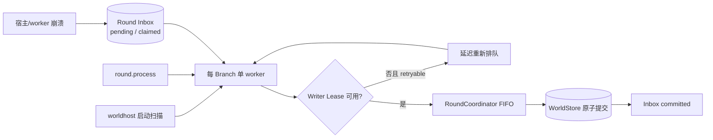

# GLM 暂停点审查修复报告

> 日期：2026-08-23
>
> 范围：quarantine 恢复闭环、存量 Manifest 兼容、耐久 Round 恢复驱动、CLI/Headless 工程性
>
> 状态：审查列出的 3 个高危项已关闭；相关中危项已修复或明确保留为 fail-closed 设计
>
> 本轮提交：`6e0046b`、`02c30f6`、`78e359e`、`4b74147`

## 结果摘要

本轮没有放宽 Event Log、Hash、fencing、as-of 或 Session 幂等不变量。修复路径以“先恢复可读性，再恢复写能力”为原则：隔离期间允许直接查询耐久 Round，恢复验证通过后才重新开放运行时；宿主重启通过耐久 Inbox 扫描恢复 pending/claimed Round，不依赖再次提交新消息。

三个高危缺陷均已关闭：

1. quarantine 中止 Round 统一使用 `player-round-result` Hash 域，真实隔离写入可以被 `readStatus`、逻辑导出和同键重放验证。
2. 存量 schemaVersion 1 Manifest 保持原字节和原 Hash，不重新激活；运行时通过纯函数派生 V2 执行视图。
3. Headless 启动扫描未完成 FIFO，并新增 `round.process`；retryable Writer Lease 失败会在宿主存活期间重新排队，claimed Round 不再依赖“再提交一轮”恢复。

## 修复映射

| 审查项 | 修复结果 | 主要证据 |
|---|---|---|
| 中止 Round Hash 域错配 | 写入与读取统一为 `player-round-result`；测试从真实 quarantine 路径读取 failed 结果 | `quarantine.ts`、`quarantine.test.ts` |
| failureId 恢复后复发 fail-open | 只有“failure open 且 Branch 已 quarantined”才幂等早退；recovered failure 复发会重新施加完整屏障 | `applyBranchQuarantine` 重入测试 |
| recover 强制 admission=open | quarantine 审计耐久记录 `priorAdmissionState`；成功恢复原 open/draining 意图 | draining 恢复测试 |
| quarantined 时 round.get 不可用 | `roundStatus`/完成结果改为耐久只读路径，不挂载 Writer；完整性错误仍触发 quarantine | Application 隔离→查询→恢复链路 |
| quarantined 时同键 replay 被挡 | 受理不再先挂载 Writer；Inbox 在准入屏障前验证同键 replay，新键仍被阻止 | failed Round 同键 replay 测试 |
| Session 领先于恢复 World 未检测 | 恢复同时执行 World→Session 与相关 Session→World 双向绑定对账 | Session future delivery 测试 |
| V1 Manifest 挂载 TypeError | 新增只读运行时适配，不改存量 Manifest/Genesis/Event Hash | ADR-0042、真实旧库挂载并提交 Round |
| orphan Round 无恢复驱动 | 启动扫描 active Branch 的 pending/claimed FIFO；新增 `round.process`；retryable 失败有延迟重试 | ADR-0043、硬终止 claimed worker 测试 |
| worker 失败不可观测 | 固定基数 metric `round_worker_failures` + 同事务 Branch Audit `round.worker.failed` | typed/untyped failure 测试 |
| Availability 无 RPC | 新增 `character.availability.get/set`，状态仍是非世界事实 | RPC 合法/非法状态测试 |
| CLI --wait 把 null 当成功 | null/undefined、缺 roundId、超时和非法参数统一返回 canonical ErrorEnvelope | CLI 回归测试 |
| Headless 无背压/错误/信号收口 | stdout 等待 drain，传播同步/异步 EPIPE；AbortSignal 驱动 SIGINT/SIGTERM 有序关闭 | Headless 单元测试与进程入口 |

## 兼容性决定

ADR-0042 冻结以下边界：

- WorldStore 中已持久化的 V1 Manifest 字节、`manifestHash` 和旧 Genesis 事件不可改写。
- `runtimeManifestFromStored` 只生成内存执行视图，不参与历史 Hash、Export 或重放身份。
- 未知 schemaVersion 和缺失的当前运行字段显式 fail-closed，不再使用 TypeScript 裸强转。

## Round 恢复路径



该流程不 force-steal Writer Lease。宿主关闭后停止重新排队；Round Inbox 和 WorldStore 始终是恢复事实源。

## 验收证据

统一命令：

```powershell
corepack pnpm@11.7.0 check
```

本机 Windows / Node 24 验收结果：

| 项目 | 结果 |
|---|---|
| TypeScript strict | 通过 |
| Oxlint | 通过 |
| Coverage 测试 | 33 文件、179 项通过 |
| Statements | `100% (3033/3033)` |
| Branches | `100% (1847/1847)` |
| Functions | `100% (561/561)` |
| Lines | `100% (2635/2635)` |
| P0～P6 Integration | 全部通过 |
| 子进程硬崩溃矩阵 | 17 项通过，新增 claimed Round 硬终止恢复 |

## 有意保留的边界

- 同一 deterministic `failureId` 若绑定不同 ErrorEnvelope bytes，仍以 `BUNDLE_HASH_MISMATCH` fail-closed；不会为通过屏障而静默覆盖证据。
- quarantined Branch 仍禁止普通 admission、fork 和 archive；可用操作是耐久只读查询、`quarantine.explain` 与受控 `quarantine.recover`。这是隔离语义，不作为行政捷径放开。
- Application 模式下旧的 `branch.drain/open` 与 `audit.list` 低层直通仍禁用。完整 Maintenance/通知/最终冻结方法面属于 Release Closure 后续单元，不在本轮借修复名义扩大。
- 跨平台 Windows/Ubuntu × Node 22.19/24 的远程 CI 实跑证据仍未产生；本报告只声称本机门槛通过。

## 暂停点

本轮修复提交后暂停，不自动进入新的 Release Closure 功能单元。继续开发时应以冻结规格剩余项为准，而不是回头改写本轮已经闭合的 quarantine、Manifest 兼容或 Round 恢复语义。
