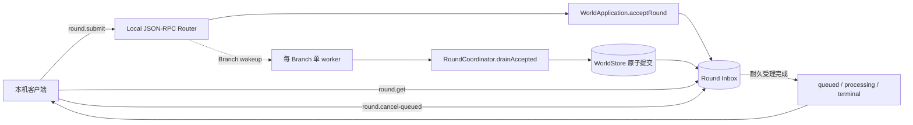

# 异步 Round 与本机 Headless 进度报告

> 日期：2026-08-23
>
> 对应提交：`88ec6c1131ba51f4723316c18e54e81b41871b4c`
>
> 当前状态：本轮功能单元已完成并暂停；严格 V0 Release Closure 尚未全部完成。
>
> 范围边界：本轮没有继续实现通知、完整冻结 RPC 方法面、Host 配置/`instance.lock` 或跨平台发布门槛。

## 结果摘要

本轮把 `round.submit` 从同步执行改为耐久异步受理：请求写入 Round Inbox 后立即返回稳定 `roundId` 和状态，实际 Round 由每 Branch 单 worker 在后台排空。调用方可通过 `round.get` 恢复状态，只能在 `queued` 阶段通过事务 CAS 取消；CLI 的 `--wait` 仅执行有界轮询，不改变服务端语义。

同时新增 newline-delimited JSON-RPC stdio Headless Host。它不监听 TCP、Pipe 或 Socket，适合作为后续本机 CLI 和自动化调用的长驻入口。

本轮代码、测试和决策记录已经以一个可审阅提交落库，提交后工作树保持干净。

## 本轮完成内容

| 层次 | 完成内容 | 主要落点 |
|---|---|---|
| Contracts | 新增 `ROUND_NOT_CANCELLABLE` 错误码 | `packages/contracts/src/errors.ts` |
| Store | 确定性 `roundId`、耐久状态查询、queued 取消与审计 | `packages/store-sqlite/src/round-inbox.ts` |
| Application | 新增受理、后台排空、状态查询和取消入口 | `packages/application/src/round-coordinator.ts`、`world-application.ts` |
| RPC | `round.submit/get/cancel-queued` 异步协议；每 Branch worker 去重和唤醒 | `packages/operations/src/rpc.ts` |
| CLI | `--wait` 通过 `round.get` 有界轮询 | `packages/operations/src/cli.ts` |
| Headless | stdin/stdout newline-delimited JSON-RPC 循环及进程入口 | `packages/operations/src/headless.ts`、`process/headless-entry.ts` |
| Test | 状态、取消、并发 worker、失败隔离、CLI 和 Headless 测试 | `packages/**/**.test.ts`、`tests/p5.integration.test.ts`、`tests/p6.integration.test.ts` |
| Decision | 冻结本轮异步语义、竞态处理和边界 | `docs/adr/ADR-0041-async-round-headless.md` |

## 当前调用路径



该路径中，Round Inbox 和 WorldStore 是恢复事实源；Router 内的 Promise、worker Map 和 wakeup 标记都不是权威状态。

## 关键设计决定

### 耐久受理与稳定身份

- `RoundInbox.enqueue` 成功即代表 `round.submit` 的受理完成。
- `roundId` 由完整 `WorldAddress`、Inbox 序号、幂等键和输入 Hash 进行域隔离推导。
- 相同幂等输入在重启后得到相同 `roundId`；同键分歧仍然 fail-closed。
- 同键重放如已经进入 `failed` 或 `cancelled`，提交响应会如实返回终态，不伪装为重新 queued。

### 状态查询与取消

- `round.get` 必须且只能使用 `roundId` 或 `idempotencyKey` 之一。
- 耐久状态为 `queued | processing | committed | failed | cancelled`。
- `round.cancel-queued` 在 `BEGIN IMMEDIATE` 中完成状态检查、`pending → cancelled` 更新、结果 Hash 和 Branch Audit。
- 已 claimed、committed 或 failed 的 Round 返回 `ROUND_NOT_CANCELLABLE`；重复取消返回原耐久结果。

### 后台 worker 竞态闭合

- 同一 Branch 同时最多存在一个本地排空 worker。
- 第二次受理发生在 worker 执行期间时，只追加 wakeup 标记，不创建并行 worker。
- worker 在退出前同步清除自己的注册；受理发生在退出边界时，要么被现有循环观察到，要么在注册清除后启动新 worker。
- worker 异常不会写入虚假完成状态；耐久 Round 保持可查询，后续 wakeup 可以重试 Branch FIFO。
- Router 关闭会等待当前以及退出窗口重新唤醒的 worker 收口。

### 本机 Headless 与 CLI

- `worldhost` 从 stdin 逐行读取 JSON-RPC 2.0 请求，并向 stdout 逐行输出 canonical JSON 响应。
- EOF 时关闭 Router 和 Application；没有网络监听或远程访问面。
- `worldappctl ... round submit ... --wait` 只轮询 `round.get`，默认等待上限为 30 秒。
- 缺失 `roundId`、无效等待参数或等待超时都会显式失败。

启动 Headless Host：

```powershell
corepack pnpm@11.7.0 worldhost -- D:\path\to\world.sqlite D:\path\to\session.sqlite
```

## 验收结果

统一验收命令：

```powershell
corepack pnpm@11.7.0 check
```

| 验收项 | 结果 |
|---|---|
| TypeScript strict typecheck | 通过 |
| Oxlint | 通过 |
| 生产文件 Statements | `100% (2879/2879)` |
| 生产文件 Branches | `100% (1783/1783)` |
| 生产文件 Functions | `100% (541/541)` |
| 生产文件 Lines | `100% (2495/2495)` |
| Coverage 测试 | 33 个文件、167 项全部通过 |
| P0～P6 集成测试 | 全部通过 |
| 子进程硬崩溃测试 | 16 项全部通过 |

新增或加强的重点场景包括：

- queued、processing、committed、failed 和 cancelled 的耐久查询；
- `roundId` 与 `idempotencyKey` 两种选择器及非法组合；
- queued 取消、重复取消、不可取消状态和损坏结果 Hash；
- 同 Branch 并发 wakeup 去重以及 worker 退出窗口再入队；
- worker 失败隔离和 Router 关闭等待；
- CLI 轮询完成、queued/processing 超时、缺失身份和空状态响应；
- Headless 多行请求、非法 JSON、空行和 EOF。

## 证据链

### E-001

- title: 本轮最小 Git 提交
- observed_at: 2026-08-22T22:58:38+08:00
- source_type: command
- source_ref: `git show --stat 88ec6c1`
- content_hash: n/a
- artifact_path: n/a
- repro_command: `git show --stat --oneline 88ec6c1`
- raw_excerpt: `22 files changed, 631 insertions(+), 45 deletions(-)`
- linked_workitem: n/a
- supersedes: none

### E-002

- title: 统一本机验收通过
- observed_at: 2026-08-22T22:58:16+08:00
- source_type: command
- source_ref: `corepack pnpm@11.7.0 check`
- content_hash: n/a
- artifact_path: n/a
- repro_command: `corepack pnpm@11.7.0 check`
- raw_excerpt: `typecheck、lint、coverage、P0～P6 integration、16 crash tests 全部 exit 0`
- linked_workitem: n/a
- supersedes: none

### E-003

- title: 逐生产文件覆盖率门槛
- observed_at: 2026-08-22T22:57:48+08:00
- source_type: log
- source_ref: Vitest V8 coverage summary
- content_hash: n/a
- artifact_path: n/a
- repro_command: `corepack pnpm@11.7.0 test:coverage`
- raw_excerpt: `Statements 100%; Branches 100%; Functions 100%; Lines 100%`
- linked_workitem: n/a
- supersedes: none

### F-001

- title: 异步 Round 本机协议单元达到本机合入门槛
- severity: info
- category: design
- status: validated
- evidence_ids: [E-001, E-002, E-003]
- location: `packages/store-sqlite/src/round-inbox.ts`、`packages/operations/src/rpc.ts`
- impact: Round 受理不再被 Provider 时延绑定，并且 queued 取消、状态恢复和 worker 竞态均有耐久语义与测试证据。
- confidence: high
- repro_steps:
  1. 检出提交 `88ec6c1`。
  2. 执行 `corepack pnpm@11.7.0 install --frozen-lockfile`。
  3. 执行 `corepack pnpm@11.7.0 check`。
- remediation: n/a
- optional_attack: n/a

### P-001

- title: 异步 Round 调用与恢复路径
- path_type: callflow
- start: 本机客户端提交玩家动作
- goal: 耐久提交 Round，或查询/取消其可恢复状态
- steps:
  1. action: Router 调用 `acceptRound`，Round Inbox 原子受理并返回稳定身份。evidence: E-002。finding: F-001。
  2. action: Router 唤醒每 Branch 单 worker，Coordinator 按 FIFO 排空。evidence: E-003。finding: F-001。
  3. action: WorldStore 原子提交后，Inbox 进入 committed；失败则保留耐久可查询状态。evidence: E-002。finding: F-001。
  4. action: 客户端通过 `round.get` 恢复结果，或在 pending 阶段事务取消。evidence: E-003。finding: F-001。
- residual_risks: 通知流、完整冻结方法面、Host 实例锁和跨平台发布证据仍属于后续 Release Closure。

## 项目进度位置

| 范围 | 状态 | 说明 |
|---|---|---|
| Phase 0～6 Reference Architecture | 已完成本机门槛 | Windows / Node 24 已验证 |
| 独立审查高危修复 | 已完成已登记单元 | 包括并发、恢复、隔离、审计与权威边界加固 |
| WorldSpec/Manifest、Lifecycle、Availability、Quarantine、Upcaster | 已完成当前设计落点 | 已有代码与回归测试 |
| 异步 Round、查询、queued 取消、本机 Headless | 本轮完成 | 提交 `88ec6c1` |
| 完整冻结 RPC 方法面 | 未闭合 | 后续需继续对齐全部 Release Closure 方法 |
| Ephemeral Notifications 与查询恢复 | 未闭合 | 尚未进入本轮 |
| Host 配置、数据目录与 `instance.lock` | 未闭合 | 尚未进入本轮 |
| Windows/Ubuntu × Node 22.19/24 发布证据 | 未闭合 | CI 已配置，但没有四格实际运行证据 |
| V0 版本、最终样例、Runbook 与 Closure 报告 | 未闭合 | 应在功能门槛全部关闭后统一收口 |

因此，当前可以声称“异步 Round 与本机 Headless 单元完成”，但不能声称严格 V0 已发布完成。

## 暂停点

本轮结束后没有启动下一个 Release Closure 单元。恢复开发时，应从剩余冻结 RPC 方法面、通知或 Host 配置/`instance.lock` 中选择一个最小单元继续，并继续遵守“实现与测试同提交、生产文件逐项 100% 覆盖率、完整 `pnpm check` 后才提交”的门槛。
