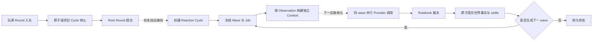

# Harness / Cordis World Phase 9B 阶段进度报告

| 项目 | 内容 |
| --- | --- |
| 日期 | 2026-09-01 |
| 分支 | `phase9b/bounded-multi-wave` |
| 当前提交 | `ef1fff2` |
| 状态 | **进行中：多 wave 权威骨架与 Reaction Context 已完成，自动运行闭环尚未完成** |
| 对照规格 | [Phase 9 有界自主 Reaction Cycle](spec/phase-9-implementation-v0.1.md) |

> **使用边界：** 当前代码已经能可靠保存、恢复和检查一个多 wave Reaction Cycle，但尚不能仅靠一次玩家输入自动让 NPC 连续对话。正式 Scheduler、Manifest 能力门和 Presentation 接通前，不应把 `responsive/v1` 宣称为可用产品能力。

## 结论

Phase 9B 已越过最危险的存储一致性阶段：玩家抢占、wave 裁决、下一 wave 传播、预算终止、查询取消和 NPC 专属 Context 都有正式契约与测试。一次 Reaction Round 的世界事件、Head、Outbox、Authority、Job settle、Cycle 状态和下一 wave 可以在同一 SQLite 事务内一起提交或一起回滚。

当前缺口集中在运行层，而不是数据模型层：还没有正式 Scheduler 去并行调用同 wave 的 NPC Provider，也没有由 Root Round 自动创建并持续驱动 Cycle。换句话说，轨道、信号和刹车已经铺好，列车还没有接入自动驾驶。

## 当前能力边界



实线部分已经有生产实现；虚线部分是下一阶段要闭合的应用运行路径。

## 本阶段已完成

| 能力 | 当前结果 | 关键提交 |
| --- | --- | --- |
| 玩家抢占 | 新玩家输入与旧 Cycle 的 `stop_requested(player_preempted)` 在同一 Inbox 事务完成，失败时一起回滚 | `3a8bcf8` |
| Wave 原子收口 | 世界事件、Outbox、Round Authority、Head、Job settle 和 Cycle 状态在同一 `commitRound` 事务提交 | `9cb6d68` |
| 有界多 wave | 最多 3 waves、8 calls、每角色 2 calls；后续刺激只来自上一 wave 已提交 Observation | `9649f28` |
| 终止原因闭集 | quiescent、all abstained、call/wave/token/deadline 限额、Provider terminal 和停止请求均由耐久状态推导 | `9649f28` |
| 查询与取消 | `reaction.get/list/cancel` 已进入 WorldApplication 与 JSON-RPC；返回隐私安全的 Cycle View | `34fbb10` |
| Reaction Context | 以精确 Observation seq/hash 构建角色独立 Context、Context Receipt 和 Provider Request，不伪造玩家 Action | `ef1fff2` |
| Memory 边界 | Reaction 刺激通过明确 source refs 召回，保留角色、Branch 和 as-of 隔离 | `ef1fff2` |
| 崩溃恢复 | 覆盖 wave settle、下一 wave 创建、玩家抢占和显式取消的真实子进程硬终止窗口 | `9cb6d68`～`34fbb10` |

本分支相对 Phase 9A 汇总点新增 5 个独立提交，涉及 19 个文件，约 2,669 行新增实现与测试。未修改上游 Harness 源码，也未启用真实 Provider 或网络监听。

## 尚未完成与风险判断

| 缺口 | 为什么仍是阻塞项 | 处理原则 |
| --- | --- | --- |
| 正式 Reaction Scheduler | 当前只有 `prepareReaction`，没有生产路径执行 claim → Context → Provider → validate → Rulebook → commit | Scheduler 必须复用现有 Writer lease、ProviderCall append-once 和 `commitRound`，不得建立第二事实源 |
| 同 wave 真并行 | 存储顺序稳定，但尚无运行测试证明总耗时接近最慢调用、结果不受 Promise 完成顺序影响 | 先冻结参与者与预算，再并行调用；提交仍按稳定 `ActionOrderKey` 排序 |
| Provider 崩溃状态恢复 | prepared、dispatch_started、response_received、validated 到 world commit 的完整恢复路径尚未由 Reaction Worker 串起 | dispatch 前可安全重试；可能已 dispatch 的调用不得自动重发 |
| Root Round 自动开 Cycle | Store 支持原子附带 Cycle Draft，但 RoundCoordinator 尚未按 Manifest 和 Observation 自动生成它 | 只对显式 `responsive/v1` 新 World 启用；旧 World 永远保持 disabled |
| 取消后的无派发收口 | `cancel` 可写 `stop_requested`，但尚缺“没有 Job 可/应 claim 时直接形成终态”的正式 Worker 操作 | 增加受 fencing 保护的短事务闭合，不靠内存判断 |
| 自动唤醒与 Presentation | API 能查状态，但提交后不会自动 drain，也没有连续反应通知和因果链展示 | 先完成 Branch 内驱动，再接 level-triggered wake hint 与展示层 |

目前没有发现需要放宽 World Event Log 权威、Hash、as-of、SQLite 原子性或模型提案边界的问题。主要工程风险是跨 World/Context 两库的 Provider 生命周期与异步运行恢复，而不是领域语义失控。

## 验证证据

### Evidence

| ID | 不可变观察 | 来源与复现 |
| --- | --- | --- |
| E-001 | `ef1fff2` 上完整 `pnpm check` 退出码为 0 | `corepack pnpm@11.7.0 check` |
| E-002 | 71 个测试文件、756 项覆盖测试通过；statements / branches / functions / lines 均为 100% | Vitest V8 coverage 输出 |
| E-003 | P0～P6、Phase 8 长历史性能门禁全部通过 | `pnpm check` 集成测试阶段 |
| E-004 | 29 项真实子进程硬崩溃测试通过，其中包含 Reaction wave、抢占与取消窗口 | `tests/crash.test.ts` |
| E-005 | `round-coordinator.ts` 尚无 Cycle 创建/驱动接线，应用层只暴露查询、列表和取消 | 当前提交源码检查 |
| E-006 | `context-pipeline.ts` 已提供 `prepareReaction`，但没有生产 Scheduler 调用它 | 当前提交源码检查 |

### Findings

| ID | 结论 | Evidence | 置信度 |
| --- | --- | --- | --- |
| F-001 | 多 wave 的权威数据模型、事务闭合与恢复骨架已达到继续接运行层的条件 | E-001～E-004 | 高 |
| F-002 | Phase 9B 尚未达到“玩家一次输入后 NPC 自动形成至少两 wave 对话”的退出条件 | E-005、E-006 | 高 |
| F-003 | 下一步应优先实现单个 Branch 内的正式 Scheduler，而不是继续扩 Schema 或增加玩法 | E-002、E-005、E-006 | 高 |

### Path

P-001（当前到 Phase 9B 完成的实施路径）：

1. 以 E-006 的耐久 Reaction Context 为输入，接入正式 ProviderCall 生命周期；
2. 同 wave 完成稳定预算预留与并行 Provider 调用，输出只作为提案；
3. 用 Rulebook 裁决后通过现有 E-001～E-004 所验证的原子 settlement 提交；
4. 从提交结果创建下一 wave 或耐久终态，并处理取消/抢占；
5. 最后把 Root Round、唤醒、通知与 Presentation 接到这条已验证路径。

残余风险：dispatch 后崩溃的外部调用无法获得 exactly-once 计费保证；系统只承诺世界效果 at-most-once，并把不确定调用收敛为可审计终态。

## 接下来的实施计划

后续按五个最小可审阅单元推进，每个单元相关测试通过后单独本地提交。

| 顺序 | 实施单元 | 主要交付 | 单元退出条件 |
| --- | --- | --- | --- |
| 1 | 单 wave Scheduler | Branch 内 Reaction Worker；批量 claim 已冻结 Job；构建 Context Receipt；并行调用 Scripted Provider；每次最多一个 `speak@1` | 两个 NPC 同 wave 真并行，Promise 返回顺序改变时 Authority/事件 Hash 不变 |
| 2 | Provider 生命周期与恢复 | prepared、dispatch_started、response_received、validated、settled 的恢复对账；dispatch 歧义终态；Reaction 专属故障点 | dispatch 前崩溃可恢复，dispatch 后不明不重发，重复驱动不产生第二次世界效果 |
| 3 | Cycle 驱动与停止闭合 | 自动推进下一 wave；无派发取消/抢占终态；deadline、预算和 quiescent 收口 | 精确命中 3/8/2 边界；任意时点抢占都不插入半个 wave、不恢复旧 Cycle |
| 4 | Manifest 与 Root Round 接线 | 为新 Manifest 增加显式 `reaction-policy/v1`；RoundCoordinator 从已提交 Observation 原子创建首 wave | 旧 World Hash/行为不变；新 World 一次玩家输入可自动产生至少两 wave 对话 |
| 5 | API、通知与 Phase 9B 验收 | level-triggered wake、Cycle 进度通知、Presentation 因果链、双 NPC Golden、阶段收口报告 | Phase 9B 验收矩阵通过，完整 `pnpm check` 通过，工作树只保留用户原有未跟踪文件 |

推荐的下一提交是：

```text
feat(application): schedule one reaction wave
```

它只闭合“已冻结 Job 如何安全变成一个 Reaction Round”，暂不同时引入 Manifest 自动启用、Host 全局扫描或 Presentation。这样可以先用 Scripted Provider 把最复杂的 Provider/事务边界钉死，再扩大运行范围。

## Phase 9B 之后

Phase 9C 不提前混入当前提交。Phase 9B 完成后再处理：Host worker 生命周期、跨 Branch 公平性和背压、maintenance/archive/fork/quarantine 边界、长历史与并发基线、Pack 创作入口、真实磁盘迁移和 Release Closure。

真实 API Key 仍不属于 Phase 9 的完成条件；本阶段继续使用 Scripted Provider 验证架构，避免网络不确定性掩盖权威和恢复问题。

## 本阶段提交

```text
3a8bcf8 feat(store): atomically preempt reaction cycles
9cb6d68 feat(store): atomically settle reaction waves
9649f28 feat(store): propagate bounded reaction waves
34fbb10 feat(operations): expose reaction cycle controls
ef1fff2 feat(context): prepare npc reaction stimuli
```
