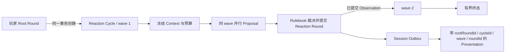

# Harness / Cordis World Phase 9B 完成报告

> **结论：** Phase 9B 已完成。一次玩家输入现在可以在显式启用 `responsive/v1` 的 Manifest v5 世界中触发有界、多 wave 的 NPC 连续反应；每个 Reaction Round 都是独立、可重放的世界事实，并能经 Session 与 Presentation 追溯到同一 Root Cycle。

| 项目 | 内容 |
| --- | --- |
| 日期 | 2026-09-02 |
| 分支 | `qwen`（待合回 `phase9b/bounded-multi-wave`） |
| 本次验证提交 | `a1aa750` |
| 状态 | **Phase 9B 本机门槛完成；Phase 9C 尚未开始** |
| 对照规格 | [Phase 9 实施规格：有界自主 Reaction Cycle](spec/phase-9-implementation-v0.1.md) |

## 最终用户现在能得到什么

在启用该能力的新世界中，玩家只需发出一次输入，NPC 就能在同一个因果链里继续回应，而不需要玩家不断发送无意义消息来推动时间。系统仍然保持这些边界：

- NPC 输出只是 Proposal，必须经过 Validator、Rulebook 与世界事务才能成为事实；
- 同 wave 的 NPC 基于同一冻结水位并行思考，不能偷看彼此尚未提交的提案；
- wave 之间串行，后一 wave 只能看到前一 wave 已提交的 Observation；
- 每个 Reaction Round 单独推进 Tick，不在一个 Tick 内隐藏“微步”；
- 玩家新输入只在当前 wave 完整收口后抢占，旧 Cycle 不会在之后复活；
- `responsive/v1` 固定最多 3 waves、8 次 NPC 调用、每角色 2 次，每次最多一个 `speak@1`。



## 本轮接手完成的收口

| 单元 | 已完成行为 | 证据位置 |
| --- | --- | --- |
| Presentation 因果链 | Reaction Outbox 写入 `rootRoundId → cycleId → wave → roundId`；渲染结果与 `presentationHash` 绑定同一因果来源 | `packages/application/src/reaction-scheduler.ts`、`packages/presentation/src/presenter.ts` |
| 非权威通知 | `reaction.started`、`reaction.round_committed`、`reaction.completed` 均从耐久 Cycle/Wave 快照投影 | `packages/operations/src/rpc.ts` |
| 三条运行入口 | 自动 Round worker、启动恢复和显式 `reaction.process` 统一读取耐久记录后发送通知 | `packages/operations/src/operations.test.ts` |
| Session 端到端 | 两个 wave 经真实 Outbox 投递到 Session，按权威顺序渲染并保留不同 Reaction Round ID | `packages/operations/src/operations.test.ts` |
| 重启可重建 | 关闭应用后重新挂载，相同 Session 事件得到逐字相同的 Presentation 与 Hash | `packages/operations/src/operations.test.ts` |
| Memory 重启幂等 | 更高的已验证 Memory 水位可以结算其覆盖的旧 Cognitive Job，不再把健康重启误判为水位倒退 | `packages/memory/src/cognitive-context.ts` |

通知只是运行提示，不参与 Scheduler 或权威裁决。它们允许重复、乱序或丢失，消费者使用 `WorldAddress/cycleId/wave/roundId` 去重，并通过 `reaction.get/list` 重新同步。快速的 Scripted Cycle 可能在一次耐久快照投影中连续发出 started、committed 与 completed；因此不能把通知到达时间解释成新的世界事实。

## 验收结果

2026-09-02 在 Windows、Node 24 本机执行：

```powershell
corepack pnpm@11.7.0 check
```

结果：

| 门槛 | 结果 |
| --- | --- |
| TypeScript strict | 通过 |
| Oxlint | 通过 |
| Coverage tests | 74 个测试文件、795 项测试通过 |
| 生产代码覆盖率 | statements / branches / functions / lines 均为 100% |
| P0～P6 integration | 全部通过 |
| Phase 8 performance | 3 项通过 |
| 子进程硬崩溃矩阵 | 29 项通过 |

本次新增端到端矩阵覆盖：双 wave 通知、坏订阅者隔离、显式处理、启动恢复、旧 Cycle 不误报、Session 投递、Presentation 因果链、重启 Hash 全等，以及较新 Memory 水位覆盖旧 Cognitive Job 的恢复路径。

## 提交记录

本次从 Qwen 未提交工作接手后形成三个最小提交：

```text
982012d feat(presentation): trace reaction messages to root cycles
01b5859 feat(operations): publish durable reaction lifecycle notifications
a1aa750 fix(memory): settle subsumed cognitive jobs on restart
```

前置的 Manifest v5、Root Round、Scheduler、抢占与 Host worker 实现仍由当前分支此前的独立提交保留；本次没有改写 Accepted ADR，也没有扩大 `responsive/v1` 的预算或 Action 范围。

## Evidence → Finding → Path

### Evidence

| ID | 不可变观察 | 来源 | 复现 |
| --- | --- | --- | --- |
| E-001 | Reaction Outbox 与 Presentation 保存完整 Root Cycle 因果链 | `982012d` 及对应测试 | `corepack pnpm@11.7.0 test packages/presentation/src/presenter.test.ts packages/operations/src/operations.test.ts` |
| E-002 | 三类通知只从已提交 Cycle/Wave 记录投影，坏订阅者不改变 Cycle 终态 | `01b5859` 及 Operations 测试 | 同上 |
| E-003 | 应用重启前后 Session Presentation 与 Hash 全等 | `a1aa750` 中的 Operations 回归测试 | `corepack pnpm@11.7.0 test packages/operations/src/operations.test.ts` |
| E-004 | 较新、已验证的 Memory 水位可安全覆盖旧 Cognitive Job | `a1aa750` 中的 Memory 单元测试 | `corepack pnpm@11.7.0 test packages/memory/src/cognitive-context.test.ts` |
| E-005 | 完整本机门槛通过，覆盖率四项 100%，29 项硬崩溃测试通过 | 2026-09-02 本机输出 | `corepack pnpm@11.7.0 check` |

### Findings

| ID | 结论 | Evidence | 置信度 |
| --- | --- | --- | --- |
| F-001 | Phase 9B 的权威执行、自动驱动、抢占、恢复、通知与最终展示已形成正式闭环 | E-001、E-002、E-003、E-005 | 高 |
| F-002 | Reaction Presentation 可由耐久 World/Session 记录重建，不依赖 Provider 返回时序或进程内缓存 | E-001、E-003 | 高 |
| F-003 | 重启时的过时 Cognitive Job 是可被更高 verified watermark 包含的派生工作，不应回退 Memory 或触发完整性隔离 | E-003、E-004 | 高 |
| F-004 | Phase 9B 不需要真实 API Key；真实 Provider 的网络、密钥与计费边界仍属于后续阶段 | E-005 与 Phase 9 规格范围 | 高 |

### Path

P-001（从一次玩家输入到可重建连续反应）：

1. Root Round 在世界事务中提交并创建首个 Cycle/Wave——前置 Phase 9B 提交 / F-001；
2. Scheduler 从冻结的 Context 与预算产生 Proposal，经 Rulebook 后提交独立 Reaction Round——E-005 / F-001；
3. 下一 wave 只消费上轮已提交 Observation，直至耐久终态或玩家抢占——E-005 / F-001；
4. Operations 从耐久 Cycle/Wave 投影通知，Session 从 Outbox 接收已裁决 Observation——E-001、E-002 / F-001；
5. Presenter 将消息绑定到 Root Cycle 因果链，重启后按相同记录重建相同 Hash——E-003、E-004 / F-002、F-003。

残余风险：Provider 在 dispatch 后、结果落账前崩溃时，系统只保证世界效果 at-most-once，不承诺外部计费 exactly-once；通知也不是可靠消息队列。以上边界由既有 ADR 接受，本轮没有掩盖或放宽。

## Phase 9C 的下一步

Phase 9C 单独处理运行与发布收口，不回到 Phase 9B 扩玩法：

1. 跨 Branch worker 公平性、背压与长时间运行边界；
2. maintenance、archive、fork、quarantine 与 Reaction 的行政矩阵；
3. Pack 创作入口与 `responsive/v1` 的显式配置体验；
4. 真实磁盘迁移、升级/回滚演练与 Release Closure；
5. 最终本机门槛、远程四格 CI 和版本 Tag。

真实 API Key、Harness Bridge、TencentDB 和网络监听仍不属于 Phase 9 完成条件。
