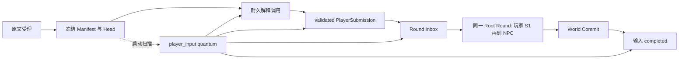

# 角色交互 C3/C4 模型无关收尾报告

| 属性 | 值 |
|---|---|
| 日期 | 2026-09-12 |
| 分支 | `codex/player-immediate-character-interactions` |
| 决策依据 | [ADR-0087](../../adr/ADR-0087-player-immediate-character-interactions.md) |
| 实施规格 | [角色交互与玩家即时成立 V0.1](../../spec/character-interactions-v0.1.md) §9.4～9.5 |
| 本报告状态 | C3/C4 仓库内模型无关实现、恢复与迁移门禁已关闭；发布门禁未关闭 |
| 持久化版本 | World v18、Logical Authority v8、Context v6；Round Authority v5 不变 |

> **发布提醒：** 本报告不把 fixture Provider、结构测试或完整工程门禁等同于真实模型可用性。生产 Player Intent Provider/Profile 入口、C0 预声明 Provider 矩阵，以及 C4 的 50 条混合输入与 20 个连续 Root Round 仍未执行；Manifest v9 仍不是发布声明。

本报告是对 [C3 运行时与 C4 恢复实施记录](2026-09-12_角色交互-C3运行时与C4恢复-report.md) 的追加收尾，不回写其当时基线，也不修改 Accepted ADR 的方向。

## 1. 收尾结果

本次把耐久 Player Input 从“提交请求触发的局部恢复”提升为 Host 可扫描、可调度、可排空的 Branch Work。`PlayerInputJobs` 在受理事务内冻结生效 Manifest Hash 以及当时 Head Seq/Hash；后台 worker 只消费这组三元 Authority，不以恢复时的当前 Manifest 或未来 Head 重解释旧输入。Operations 启动扫描会合并未完成 Player Input、Round Inbox 与 Reaction Cycle 地址，并以独立 `player_input` quantum 调度。

Logical v8 不再只搬运输入行：导入时会校验输入自身 Hash、状态证据路径、受理 Authority、Player Input 与 Round Inbox 的确定性身份、enqueue receipt，以及 completed Round/Commit/result 的绑定。未完成 claimed/processing 状态在导出时规范化为可重新 claim 的 pending 形态；已合法完成结果保持逐字节一致。篡改与正常领域拒绝仍是不同路径，导入完整性失败不会被降级成普通 Action rejected。

部署备份把 `purpose=player_intent` ProviderCall 纳入用途感知校验：Context 调用必须和同地址、同 inputId 的 World 输入记录闭合，且只接受已定义的解释终态。备份 quiet gate 会阻止未完成 Player Input 越过维护屏障；恢复后再执行相同输入不会重复 Tick。

C4 的模型无关对照已覆盖 Live/Restart、Logical export/import、deployment backup/restore、fork 前后 as-of、Snapshot bundle 与 Full Event Replay。新增 `interaction-catalog/v2` Creator 示例可把现有 v4 Pack 适配为 Manifest v9，同时有意保持 `legacy-speech/v1`；显式角色交互可试玩，但自然语言 Player Intent 不会被目录文案偷偷开启。



## 2. Authority 与恢复矩阵

| 窗口或边界 | 恢复规则 | 验证位置 |
|---|---|---|
| 原文刚受理 | 按 World FIFO claim；同键异文拒绝 | `player-input-jobs.test.ts` |
| 受理后 Manifest 改变 | 使用 acceptedManifestHash；不按新 Manifest 重解释 | `player-intent.integration.test.ts` |
| 受理后 Head 前进 | 使用 acceptedHeadSeq/Hash 构造冻结请求 | `player-intent.integration.test.ts` |
| 调用未 dispatch | 可从 World 准备证据重建 | `player-intent-worker.test.ts` |
| dispatch 后结果未知 | 进入 `timed_out_ambiguous`；禁止自动重发 | `player-intent-worker.test.ts`、`crash.test.ts` |
| validated 后进程退出 | 相同 PlayerSubmission 入同一 Inbox，不重调模型 | `crash.test.ts` |
| Round 已 enqueue | 复用确定性 round identity 与 receipt | `logical-transfer.test.ts` |
| World COMMIT 后 adopt 前退出 | 从 completed Round/Authority 对账后补输入终态 | `crash.test.ts` |
| Host 无客户端重试地重启 | startup scan 找到地址并由 scheduler 消费 | `player-intent.integration.test.ts`、`operations.test.ts` |
| Logical 导入 | 校验状态路径、Authority、Inbox、Commit 与 result 闭包 | `logical-transfer.test.ts` |
| deployment restore | quiet gate + 跨库 ProviderCall/work identity 校验 | `deployment-backup.test.ts` |
| fork / snapshot / full replay | 只继承 forkSeq 之前事实；active relation 与 Authority Hash 稳定 | `character-interaction.integration.test.ts` |

关闭顺序也纳入同一边界：`WorldApplication.close()` 先冻结当前已挂载分支集合，再等待输入 tail，最后释放成功挂载的 lease；挂载失败的 Promise 通过拒绝回调收敛，不遗留活动 Fiber。

## 3. Evidence → Finding → Path

| Evidence | 不可变观察 | 关联 Finding |
|---|---|---|
| E-001 | `PlayerInputJobs.receive` 在同一 World 事务保存 input identity、accepted Manifest 与 accepted Head；读路径逐字段 fail-closed | F-001 |
| E-002 | `processNextBranchWork` 与 Operations scheduler 能在无客户端重试时消费 `player_input` quantum | F-002 |
| E-003 | Logical v8 篡改测试覆盖缺失 activation、越过 fork 的 Head、非法状态路径、Inbox/receipt/result/commit 不一致 | F-003 |
| E-004 | deployment backup 测试覆盖完成输入与解释调用 round-trip、悬空 ProviderCall 拒绝、未完成输入 quiet gate | F-003 |
| E-005 | Character integration 测试对照 restart、snapshot、full replay、fork 前后 relation 与 inherited Authority Hash | F-004 |
| E-006 | `crash.test.ts` 的 49 项子进程硬终止测试全部通过，其中含十个 Player Intent 窗口 | F-002、F-004 |
| E-007 | v2 示例目录由真实 v4 compiler 适配为 Manifest v9，并断言 `legacy-speech/v1` | F-005 |
| E-008 | `corepack pnpm@11.7.0 check` 完整通过，107 个覆盖文件、1136 项测试，四项覆盖率均为 100% | F-001～F-005 |

Finding F-001：玩家输入的解释 Authority 已由受理时 World 事实冻结，不再依赖恢复时易漂移的当前上下文。

Finding F-002：后台恢复不依赖用户再次提交；解释失败或不确定结果有耐久终态，分支工作不会永久阻塞。

Finding F-003：Logical 与 deployment transfer 已验证 Player Input、Round、Commit、Context 之间的闭包，篡改不会作为普通领域失败混入。

Finding F-004：关系事实与输入结果在 restart、fork、snapshot、full replay 和硬终止后保持相同 as-of 语义。

Finding F-005：Creator 已有可执行的 Manifest v9 显式交互入口，但它没有越权宣称自然语言 Player Intent 或真实 Provider 已发布。

Path P-001（正常调用）：receive 原文 → 冻结 Authority → ProviderCall append-once → Validator/Host binding → PlayerSubmission → Round Inbox → 玩家组 phase 0 S1 → NPC phase 1 → 原子 Commit → completed。

Path P-002（后台恢复）：startup scan → 合并 unfinished address → `player_input` quantum → 按耐久状态继续 → 若 dispatch 歧义则 clarification 终态；若已 Commit 则 adopt，不重发、不重复 Tick。

Path P-003（传输）：quiet gate → 导出 World/Context 闭包 → Logical 或 deployment 导入 → 重算 Hash 与身份 → 恢复扫描 → 相同输入结果；任何 Authority、receipt、commit 或 result 漂移均 fail-closed。

## 4. Creator 使用与版本边界

新示例位于 `examples/world-packs/ai-girls-awaken.character-interactions.json`。它同时声明实体操作与 `core:hold-hand`，并绑定 GPT、Claude、DeepSeek、GLM 四个角色。可复现命令：

```powershell
$artifact = '.\examples\world-packs\ai-girls-awaken.worldpack.json'
$catalog = '.\examples\world-packs\ai-girls-awaken.character-interactions.json'
$data = 'D:\worlds\ai-girls-character-playtest'
corepack pnpm@11.7.0 experience:web --deepseek --pack $artifact --interactions $catalog --data-dir $data
```

显式测试命令：

```text
/interact character:gpt core:hold-hand
```

版本行为保持机械可判定：

| 输入 | Manifest | 玩家输入策略 | 发布含义 |
|---|---|---|---|
| v4 Pack，无扩展 | v6 | 历史行为 | 不升级 |
| `--action-groups` | v7 | 历史行为 | 不升级 |
| `object-interactions/v1` | v8 | 历史行为 | 对象交互 |
| `interaction-catalog/v2` | v9 | `legacy-speech/v1` | 可显式角色交互；不代表 Player Intent 发布 |
| Application 显式注入 Player Intent Profile/dispatch | v9 | `player-intent/v1` | 当前仅模型无关端口与测试；生产接入待门禁 |

详细字段和试玩步骤已同步到 [World Pack 创作者字段手册](../../current/guides/world-pack-authoring.md#17-对象与角色交互) 与 [Creator 试玩指南](../../current/guides/creator-playtest.md)。

## 5. 验证记录

以下命令均在仓库根目录运行，未访问收费 Provider：

```powershell
corepack pnpm@11.7.0 test:coverage
corepack pnpm@11.7.0 check
```

最终结果：

| 门禁 | 结果 |
|---|---|
| TypeScript strict | 通过 |
| lint | 通过；仅保留既有 `tests/experiments/grouped-runtime.test.ts:25` warning |
| coverage | 107 files / 1136 tests；statements 10986/10986、branches 7846/7846、functions 2139/2139、lines 9421/9421 |
| P0～P6 | 全部通过 |
| P8 performance | 3/3 通过 |
| crash | 49/49 通过，使用真实子进程硬终止 |

没有修改覆盖率阈值、历史 Golden Hash 或 Accepted ADR；`.gitignore` 的工作区改动不属于本实现，也不纳入提交。

## 6. 阶段判定与剩余发布门禁

| 项目 | 判定 | 原因 |
|---|---|---|
| C3 耐久状态机、Authority、后台恢复、显式降级 | 已关闭 | 模型无关实现、重启与调度证据齐全 |
| C3 生产 Provider/Profile 与 Operations/Creator 自然文本入口 | 未关闭 | 仓库尚无获准的上游 Bridge/生产适配组合；不在本阶段虚构默认 Provider |
| C4 故障、Logical、backup、fork、snapshot、full replay | 已关闭 | 专项模型无关矩阵及完整工程门禁通过 |
| C4 Pack 示例、Creator 手册、迁移说明、阶段报告 | 已关闭 | v2 示例与编译器回归测试已入库，文档已同步 |
| C0 目标 Provider 预声明矩阵 | 未关闭 | 仍需按预声明样本与阈值运行，不可用 fixture 替代 |
| C4 真实模型长程试玩 | 未关闭 | 仍需两个 Provider、至少 50 条混合输入和 20 个连续 Root Round |

因此本次可以声明 **C3/C4 模型无关收尾完成**，不能声明 **C3/C4 发布验收完成**。后续工作应作为真实 Provider 集成与体验验证批次单独提交，保留失败原文的受限证据、精确 validation path、无效率、clarification rate 和端到端 P50/P95；不得用 Prompt 承诺、关键词过滤或小模型复核替代现有结构性 Authority。
