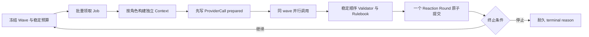

# Harness / Cordis World Phase 9B Scheduler 阶段报告

> **历史状态：** 本文记录 Scheduler 单元完成时的中间状态，其中 Manifest、Root Round、Host 唤醒与 Presentation 缺口均已在后续提交关闭。当前状态以[Phase 9B 完成报告](2026-09-02_阶段报告-Harness-Cordis-World-Phase-9B-report.md)为准。

| 项目 | 内容 |
| --- | --- |
| 日期 | 2026-09-01 |
| 分支 | `phase9b/bounded-multi-wave` |
| 验证提交 | `1e76b8e` |
| 状态 | **Scheduler 与多 wave 核心已完成；Manifest、Root Round 和 Host 自动唤醒尚未接线** |
| 对照规格 | [Phase 9 有界自主 Reaction Cycle](../../spec/phase-9-implementation-v0.1.md) |

> **产品边界：** 本阶段已经证明“一次已冻结的 Reaction Cycle 可以安全地让 NPC 连续响应多波”，但普通玩家 Round 还不会自动创建并唤醒它。当前能力是正式应用组件，不是已经默认启用的最终用户功能。

## 结论

P9B 最复杂的运行边界已经闭合：同一 wave 的 NPC 使用同一冻结 Head 并行调用 Provider，所有结果在调用结束后按稳定 `ActionOrderKey` 裁定；下一 wave 只能读取上一 wave 已提交的 Observation。模型返回快慢、玩家抢占时点和进程重启都不会改变权威事实顺序。

本次还关闭了两个容易被测试绿灯掩盖的恢复缺口：在 Provider 尚未派发前收到停止请求时，Worker 会在不调用 Provider 的情况下耐久收口；在 ProviderCall 已绑定、响应已校验但世界尚未提交时崩溃，过期 Job 可以携带原绑定被重新领取，重启后直接复用原响应，不进行第二次外部调用。

## 本阶段交付

| 能力 | 已实现结果 | 提交 |
| --- | --- | --- |
| 单 wave Scheduler | claim → Context Receipt → ProviderCall → 并行 Provider → Validator → Rulebook → Authority → `commitRound` | `cdcace3` |
| 停止前无派发收口 | `stop_requested` 的冻结 wave 可被领取用于结算，但未绑定 Job 不会创建或派发 ProviderCall | `70c9017` |
| 有界多 wave Worker | 在 Branch 串行 lane 内连续排空 wave；重复 wave 身份 fail closed | `d6a314a` |
| 玩家抢占边界 | 真实 RoundInbox 输入在波中或波间到达均不丢失、不插入半个 wave、不恢复旧 Cycle | `966a324` |
| Provider 恢复 | 过期的已绑定 Job 保留 Context/ProviderCall 身份重新领取；validated 结果复用，dispatch 歧义不重发 | `1e76b8e` |

### 权威调用路径



同 wave 的并行只存在于提案阶段。事件、Observation、Outbox、Cognitive Job、Authority、Head、Job settlement 和下一 wave 仍在同一 WorldStore 事务中形成唯一权威结果。

## 已验证的不变量

- Reaction Round 没有伪造的玩家 Action；Authority `origin.kind` 为 `reaction`。
- 每个 Job 最多产生一个 `speak@1`，非法 Action 或重复 `actionId` 在提交前拒绝。
- 同 wave 的 Provider 真并行，但 Promise 完成顺序不参与事件与 Hash 排序。
- 私语只给授权角色完整内容，其他在场观察者最多得到 occurrence-only Observation。
- 下一 wave 的刺激来自上一 Reaction Round 中已经提交且绑定 seq/hash 的 Observation。
- 玩家新输入通过原有 RoundInbox 原子写入 `player_preempted`，不会建立第二套命令队列。
- `dispatch_started` 无响应被收敛为歧义终态；`response_received`/`validated` 重启后复用；未提交 Job 指向 `committed` ProviderCall 时视为完整性分歧。
- wave、调用数、每角色调用数、token、deadline 与停止原因均由耐久数据推导。

## 验证证据

### Evidence

| ID | 不可变观察 | 来源与复现 |
| --- | --- | --- |
| E-001 | 完整 `pnpm check` 在 `1e76b8e` 后退出码为 0 | `corepack pnpm@11.7.0 check` |
| E-002 | 73 个测试文件、775 项覆盖测试通过；statements / branches / functions / lines 均为 100% | Vitest V8 coverage 输出 |
| E-003 | P0～P6 与 Phase 8 长历史性能门禁全部通过 | `pnpm check` 集成阶段 |
| E-004 | 29 项真实子进程硬终止测试全部通过，包含 Reaction settlement、continuation、抢占、取消及 ProviderCall 生命周期 | `tests/crash.test.ts` |
| E-005 | 双 NPC 一次冻结 Cycle 自动形成两波；第二波 Context 的 source seq 位于 Cycle 创建水位之后 | `packages/application/src/reaction-scheduler.test.ts` |
| E-006 | 波中与波间写入真实 RoundInbox 后，输入保持 queued，旧 Cycle 分别以 `player_preempted` 收口 | `packages/application/src/reaction-scheduler.test.ts` |
| E-007 | `provider.before-world-commit` 中断后，Job 以同一 ProviderCall 身份重新领取，Provider 调用计数保持 1 | `packages/application/src/reaction-scheduler.test.ts` |

### Findings

| ID | 结论 | Evidence | 置信度 |
| --- | --- | --- | --- |
| F-001 | P9B 的多 wave Scheduler、稳定裁定与停止语义已具备正式接线条件 | E-001、E-002、E-005、E-006 | 高 |
| F-002 | Provider 与 World 两库之间的崩溃恢复不需要放宽 at-most-once 世界效果边界 | E-004、E-007 | 高 |
| F-003 | Phase 9B 尚未满足最终用户“一次普通输入自动触发连续 NPC 反应”的产品退出条件 | E-005；当前 Root Cycle 由测试显式创建 | 高 |

### Path

P-001（从当前 Scheduler 到 P9B 产品闭环）：

1. 以 E-005 验证的 Scheduler 为唯一 Reaction 执行器；
2. 给新 Manifest 增加显式 `responsive/v1` 能力门，旧 Manifest 行为与 Hash 不变；
3. Root Round 提交时，从已提交授权 Observation 原子创建首 wave；
4. 通过 Branch level-triggered wake 调用 Worker，启动与重启都扫描耐久未终结 Cycle；
5. 用 E-006 的同一 Branch lane 保证玩家 Inbox FIFO 只在完整 wave 之间取得执行权；
6. 最后补 Presentation 因果链和双 NPC 最终用户 Golden。

残余风险：当前 Worker 仍需由调用方显式 `drain()`；没有 Host 启动扫描、自动 wake、跨 Branch 公平性或长驻运行可观测性。它们不得用轮询内存状态替代耐久扫描。

## 下一步计划

| 顺序 | 实施单元 | 退出条件 |
| --- | --- | --- |
| 1 | Manifest `reactionPolicy` 能力门 | 仅显式新版本启用；v0.3.0 及旧 Pack 的 Manifest/Registry/Genesis Hash 全等 |
| 2 | Root Round 原子创建 Cycle | 从本轮已提交 Observation 生成首 wave；无候选时不创建 Cycle |
| 3 | WorldApplication 组合根接线 | Scheduler 复用 RoundCoordinator 的 Writer lease 和 Branch lane，不建立第二 Writer |
| 4 | level-triggered wake 与启动恢复 | 漏通知不丢工作；重启扫描可恢复 active/stop_requested/过期 bound Job |
| 5 | Presentation 与 P9B Golden | 玩家一次输入后双 NPC 至少两波；因果链可查；任意时点抢占不丢消息 |

这些单元完成前，Phase 9B 状态保持“运行核心完成、产品接线进行中”，不提前进入 Phase 9C Release Closure。

## 本阶段提交

```text
cdcace3 feat(application): schedule one reaction wave
70c9017 fix(reaction): settle waves stopped before dispatch
d6a314a feat(application): drain bounded reaction cycles
966a324 test(application): cover reaction preemption boundaries
1e76b8e fix(reaction): reclaim bound provider calls
```
