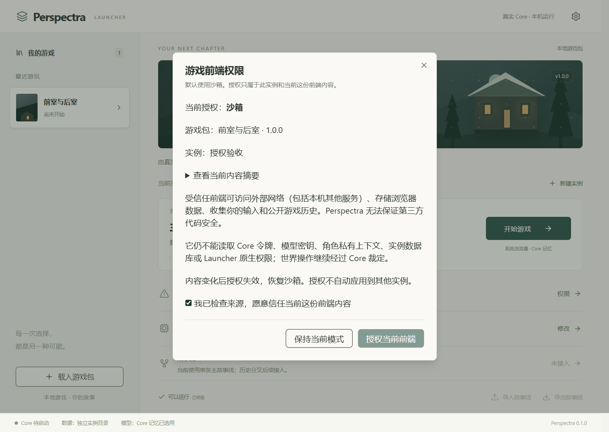
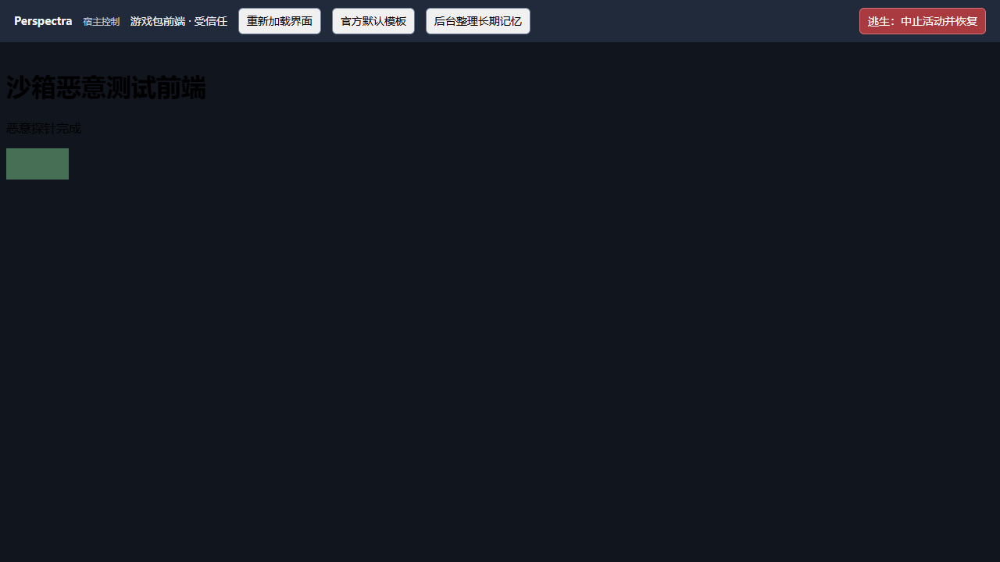
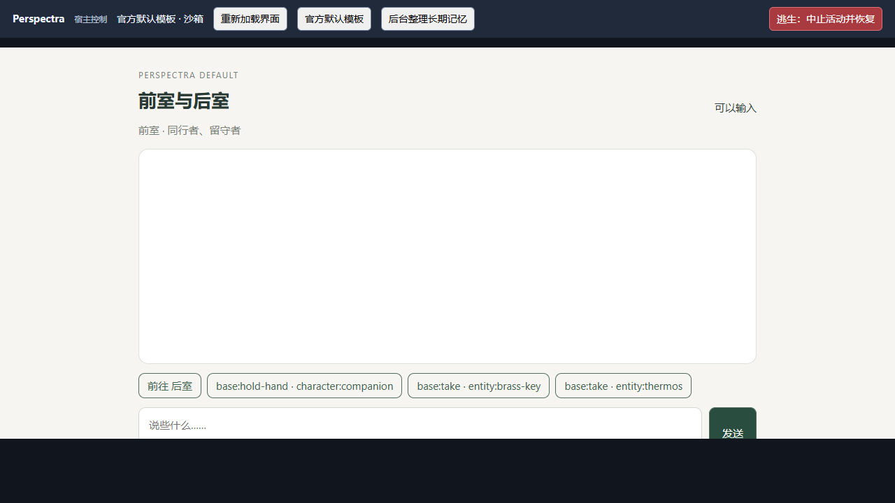

# 社区前端授权：内容绑定、双记录与受信任模式

> 玩家操作见 [玩家指南](guides/player-playtest.md#5-社区前端与授权)，作者使用公共 API 见 [前端指南](guides/web-ui.md)。前端授权不等于授权恶意后端脚本；整个包的信任边界见 [活动与变量](guides/activity-and-variables.md)。

2026-10-06。本轮按用户确认实现社区前端授权并启用受信任模式，预设后续再做。基于[前一阶段沙箱实验](frontend-v1.md)，没有增加 Core 世界事实协议或新的模型调用阶段。

## 1. 玩家使用方式

在 Launcher 实例详情点击“游戏前端 → 权限”。默认是沙箱；官方默认模板无需额外授权。社区前端授权显示包、实例和当前内容摘要，说明网络、浏览器存储与收集玩家输入/公开历史的风险。勾选明确确认后才能授权。

授权只作用于当前实例和当前前端内容；同包的新实例不继承。启用受信任模式前结束当前游戏，再开始或继续；撤销可在运行中执行，页面恢复官方沙箱模板，Core 与已提交进度继续存在。



## 2. 内容绑定和记录

`loadPackWeb` 对实际加载的所有前端文件建立快照，按规范化虚拟路径排序，将每个文件的路径、字节长度和完整内容纳入 SHA-256。HTML、CSS、JS、manifest 和素材均在范围内；增加、删除、重命名或修改文件都会改变摘要。摘要独立于世界包 Hash，换前端不改变存档身份。

本机目录：

```text
Launcher 数据目录/
  launcher.json
  frontend-authorization-key.dpapi
  frontend-authorizations/<授权 UUID>.json
  frontend-instance-authorizations/<实例 UUID>.json
  instances/<实例 UUID>/world.sqlite
```

授权主记录与实例引用均包含协议版本、授权 ID、实例 ID、包 ID、包版本、内容摘要、模式和时间。两份分别按 master / instance 用途做 HMAC-SHA256，不能互相复制代替。启动必须满足两份存在、签名正确、身份与摘要全部匹配；任一条件不满足即沙箱，不自动修复。

独立随机密钥经 Windows CurrentUser DPAPI 保护，磁盘仅保存受保护字节；明文密钥通过隐藏 PowerShell 子进程的私有 stdin/stdout 获取，不进入命令行、日志、浏览器、包或 Launcher snapshot。[Windows ProtectedData 说明](https://learn.microsoft.com/en-us/dotnet/api/system.security.cryptography.protecteddata?view=netframework-4.8)。

UI 确认对应显示时的摘要。后端授权时再次加载并比较 expectedDigest，拒绝未明确确认或内容已变化的请求。Core 子进程加载后再比较启动批准摘要，防止两次加载之间发生变化而仍进入受信任模式。

授权引用与世界存档目录分离：真实原生验收发现授权文件会触发“非空目录却缺少 world.sqlite”预检失败，已通过分离元数据修复，没有放宽存档损坏检查。

## 3. 受信任来源与权限

受信任模板使用独立的 loopback 端口，其服务只提供前端静态素材，没有 /api/*、/frontend-api/* 或 Launcher IPC 路由。持有令牌的 Host 和 Core API 留在原来源。

iframe 在受信任模式允许脚本和自身来源，从而使用浏览器存储；不同端口继续隔离 Host DOM、令牌和宿主存储。CSP 开放 HTTP/HTTPS 网络及远程展示资源/脚本；原生权限、Core Token、模型密钥、私有角色 Context 和数据库仍不提供。浏览器可能进一步限制混合内容、第三方存储或跨域响应。

初始化如实返回 frontendMode，并在受信任模式报告 external-network / browser-storage。世界操作仍经过同一公共 PlayerView / Action Gateway。没有“完整 Core 权限”模式。弹窗、顶层导航、表单、worker 等能力仍未开放。

握手验证当前 iframe 窗口、预期来源和 API 版本；向受信任页面传递 MessagePort 时使用精确目标来源。官方回退始终按沙箱初始化。

## 4. 撤销与运行时

撤销删除实例引用和它实际拥有的签名主记录；损坏或跨实例复制的引用不会借撤销删除另一个实例的有效主记录。没有引用即不能恢复信任；残留无引用主记录不授予权限。

运行中通过已有 Core IPC 撤销浏览器策略，静态受信任来源立即拒绝素材请求；Host 收到 SSE 策略变更后关闭旧端口并载入官方沙箱模板。正常路径不停止 Core，也不重置世界。

若 Core 退出，或 5 秒内未确认撤销，则保守结束自己拥有的 Core 进程，保留已提交进度并说明原因，不显示虚假的撤销成功。尚未实施撤销通知超时的专门硬故障验收。

当前执行的是启动时不可变文件快照；修改磁盘文件不热加载。下次启动、再次授权或打开权限检查时都会重新校验。运行中权限检查发现记录/内容失效，也会降级当前前端。未加入持续文件监视器。

## 5. 文件与验证

新增：

- desktop/frontend-authorization.ts：DPAPI 密钥、签名双记录、校验与撤销。
- tests/experiments/playtest-frontend-assets.ts：复用的沙箱资源头与独立受信任静态服务。
- apps/launcher/src/components/FrontendAuthorizationDialog.vue：明确确认与撤销。
- tests/prototype/frontend-authorization.test.ts、frontend-trusted.test.ts：内容、签名、隔离与撤销回归。

修改 Launcher Core、实例详情、store 和类型；修改包加载摘要、网页入口的来源生命周期、Host 握手/回退与公共初始化；同步相关测试和当前文档。

| 验证 | 结果 |
| --- | --- |
| 默认 check | 类型与 Lint通过；31 文件、216 项测试通过 |
| Launcher check | strict 类型通过；2 文件、9 项测试通过 |
| 授权/公共接口/网页服务相关检查 | 4 文件、21 项通过；覆盖真实 Windows DPAPI |
| Tauri 原生调试构建 | 新授权界面构建通过；临时 CDP 配置仅用于验收 |
| 原生 WebView | 确认前按钮禁用；明确授权、真实 Core 首启、运行中撤销通过 |
| Chromium + 真实 Core | 受信任网络请求 1 次成功，浏览器存储可用；宿主 DOM 隔离，子来源 Core 路由 404，管理桥拒绝 |
| 实时回退 | 撤销后官方沙箱页面可用，存储再次被拒绝；Core 保持 running |
| 世界进度 | 撤销前后 headSeq 都为 19；providerCalls = 0，没有追加真实模型调用 |

证据在忽略目录 `.tmp/frontend-auth-verify/`。实验使用新数据目录和复制的 prototype-g1 包附带恶意前端；没有授予日常用户实例权限，也没有修改 D:/worlds 历史数据。





## 6. 接受的限制

- 当前密钥保护仅支持 Windows；其他平台保持沙箱，未加入低强度明文密钥替代。
- HMAC 保护授权文件完整性，不是抵御拥有同一 Windows 用户权限的任意本机代码、管理员或备份回滚的证明。
- 信任绑定包内快照；主动获准的网络行为及远程内容可能变化，不能靠包内摘要保证其安全。
- 浏览器存储没有稳定的跨重启实例来源承诺；未实现统一 UI Storage API，不写世界存档。
- 授权按实例生成，不提供跨实例自动继承、集中授权管理后台、开发者模式或自动迁移。
- 仍未承诺 CPU/内存配额、跨重启操作去重和长期性能；角色预设后续已实现，见 [预设说明](model-presets.md)。

授权警告补充：受信任前端访问的远程内容可以在不改变游戏包摘要的情况下发生变化。角色预设首版见 [model-presets.md](model-presets.md)。
