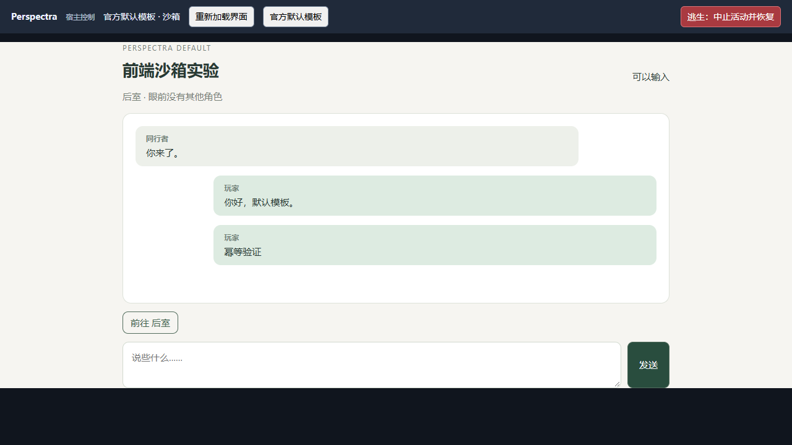
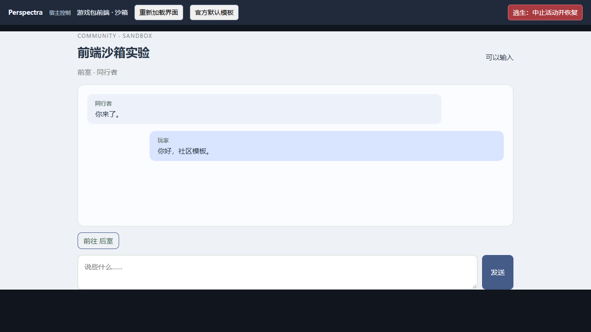
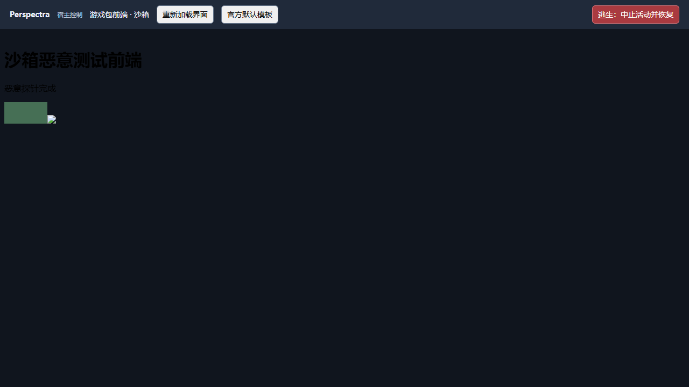

# 游戏前端 V1：最小沙箱实验

> 后续社区前端授权已实现，含内容绑定、双记录、HMAC 与受信任模式；当前边界见 [授权交付](frontend-authorization.md)。下文的沙箱描述仍适用于默认模式。

实现范围按设计方案第 26 节及用户确认：公共玩家接口、官方默认前端、iframe 社区前端和恶意用例。授权身份、签名、完整能力授权流程和预设后续再做。本实验复用既有网页 Core，没有增加世界事件协议、数据库或模型防护阶段。

## 1. 本轮结构

```text
packages/frontend/src/
  player-view.ts          公共投影、变化补丁、严格请求与会话幂等
  client.ts               iframe 使用的 window.Perspectra SDK
  default-template.ts    官方 HTML/CSS/JS
tests/experiments/
  playtest-server.ts      受保护的公共 HTTP 适配与静态素材、SSE
  playtest-host-page.ts   持有令牌的 Host、MessageChannel 桥、回退按钮
  playtest-pack-web.ts    frontend 目录与 manifest 加载
  playtest-web-entry.ts   退出时关闭包含 SSE 的连接
examples/world-packs/ai-girls-awaken-v10/frontend/
  manifest.json / index.html / app.js / style.css
tests/fixtures/frontend-adversarial/frontend/
  manifest.json / index.html / attack.js / assets/banner.svg
tests/prototype/frontend-api.test.ts
```

默认与社区前端均通过 SDK → MessagePort → Host → 公共接口 → 既有 Core；没有模板直接操作数据库的路径。公共 API 是现有 PlaytestRuntime 的小适配器，尚非独立发布的 SDK 包。

## 2. 数据与操作边界

| 公共 PlayerView | 来源 |
| --- | --- |
| game.title、player.name | 公开游戏及玩家名称 |
| scene.locationName、visibleCharacters | 当前场景及当场可见角色，不回退到全 NPC 名单 |
| status | ready / busy / paused / error |
| history | 玩家已获授权的转录，显式选取 seq / speaker / text / player |
| actions | 当前 Core affordance 中的移动和普通交互选项 |

不返回 debug、notice、phaseLabel、private variables、记忆档案、完整角色名单或转录中的附加私有字段。公共状态不透传整个 runtime.state。当前也不返回 public variables、活动详情或角色记忆摘要；活动及记忆控制暂保留在受信任外层 Host。

支持 view / history / speak / perform / subscribe / resources 六种能力。manifest 请求的未知能力不授予；Host 在每次桥请求前检查已声明能力。这只是实验中的能力白名单，不是持久化授权系统。

speak 只接受 text；perform 只接受当前 optionId，提交前重新读取 Core 的可用选项。参数来自 Core，而非 iframe，最后仍走既有 Action / Rulebook / Event 路径。与角色相关的自由表达和认知调度机制未改动。

requestId 对应一次传输；actionId 对应一次操作。同 ID、同内容的并发及后续请求复用同一结果，失败也不重复执行；同 ID 改内容拒绝。去重保留在单个服务进程内，最多 4096 个 ID，不驱逐已记录 ID；重启后没有跨进程去重承诺。超时或异常后的重试语义是查询该操作结果，不能将失败误描述为一定会再次执行成功。

## 3. 浏览器隔离

- iframe 只设置 allow-scripts，不授予 allow-same-origin、表单、弹窗或顶层导航权限；HTTP CSP 同样设置 sandbox。
- Host 令牌仅在宿主闭包中使用，读取后清除 URL fragment，不放入子页面 URL、初始化消息或公共响应。
- 握手检查指定 iframe 窗口、opaque origin 和 API 版本；随后只通过独立 MessagePort 通信。显式重新加载和回退关闭旧端口。
- CSP 阻断前端网络连接、外部脚本/图片、worker、嵌套 iframe、对象和表单；Host 的 frame-src 限制在本实例前端资源路径。
- 服务只监听本机；API 要求随机令牌并拒绝 opaque/外部 Origin。静态前端素材单独提供，无令牌或私密数据。
- 加载器只使用启动时建立的包内文件快照，拒绝路径穿越、符号链接和目录连接；资源请求不能访问另一个包、Launcher 或数据库。

这里验证的是浏览器与程序权限边界，不声称任意自然语言绝不会虚构事实，也不声称能够保护主动放入公共素材的秘密。恶意前端在自己的获准玩家权限内发言属于当前能力含义；细分授权和用户确认机制尚未实现。

## 4. 页面与事件

默认模板包含标题、可见场景、公开对话、输入框、可用操作和状态。社区示例使用同一 SDK 并改变 HTML/CSS；Host 可重新加载界面或切换官方模板，Core 实例和进度继续存在。

SSE 初始发送公共快照，此后发送差异。当前每 500 ms 从现有 runtime.state 投影变化，没有新调度器或 Core 回调协议。响应与 SSE 分别保留基线，避免同一次操作在界面重复追加转录。断连后 Host 重连并以快照恢复。

状态只有整体 busy/ready 等粗粒度变化，尚无逐角色 thinking、token 流、发言开始/结束事件。模板存储、设置、皮肤配置、预设、模板安装管理、权限 UI、签名与 HMAC 均未实施。

## 5. 验证与证据

- 新增公共接口回归覆盖字段白名单、Origin/令牌边界、能力过滤、并发去重、失败去重、操作参数限制、素材路径、SSE 和目录连接逃逸。
- 更新旧 Host/iframe 测试：旧的同源前端与 /experience/ 约定已替换，不为旧行为新增兼容分支。
- Chromium 实际运行默认、社区、受限 manifest 与恶意前端：13 类越权探测被拒绝；本地素材正常显示；重新加载保留公开历史；官方回退可用。
- 浏览器测试中的两次并发同 ID 发言只执行一次；总提交 3 次、普通移动 1 次。外部 fetch、图片与 iframe 自导航探测的接收端请求为 0。
- 这组浏览器恶意测试使用可记录调用的运行时夹具，不把它称为真实模型试玩；既有 Core 的一轮真实模型与续玩证据见 Launcher 接入报告。

截图：







## 6. 架构冲突与接受的限制

旧 web/ 页面读取 Core token 并直接访问包含诊断信息的 /api/state，与本方案存在实际冲突，本轮执行入口已改为 frontend/ 沙箱。旧素材文件保留作历史参考，旧指南改为当前契约，不自动运行它们。

既有 Core 已有玩家授权转录、场景投影、规则裁定和独立实例，可直接复用。无需增加新的世界事实层。尚未将活动表单的参数化操作并入公共 API，也未把实验网页服务迁入独立生产前端宿主包；这是明确接受的后续工作。

接口去重是进程内实验语义；无跨重启精确恢复。公开历史完整快照与 500 ms 投影适合当前实验，未做长时间性能验收。CSP/iframe 不限制 CPU 和内存，未验证无限循环、浏览器进程崩溃或稳定资源配额；不得据此宣称恶意前端不会卡住浏览器。Core 仍在独立 Node 进程，浏览器界面重载不会重置权威状态。

旧 Electron 和 Tauri 都复用本网页入口；没有接入社区授权系统或可分发安装包。新实验数据放在新目录，没有改动 D:/worlds 历史试玩数据。

## 验收命令记录

2026-10-06 最终结果：

| 验证 | 结果 |
| --- | --- |
| corepack pnpm@11.7.0 check | strict 类型与 Lint 通过；29 文件、210 测试通过 |
| corepack pnpm@11.7.0 test:related tests/experiments/playtest-server.test.ts | 1 文件、7 测试通过 |
| Chromium / Playwright 沙箱交互 | 默认、社区、受限能力、恶意探测、重载、回退、去重和 SSE 转录一致性通过 |
| 真实 Core 网关集成 | FrozenWorldPlaytestRuntime + 临时 SQLite；受控模型夹具。虚构移动无事件，合法移动有事件，重复 actionId 不再提交，活动撤销移动能力后拒绝旧选项 |
| 外部接收端 | fetch、图片和延迟观察的 iframe 自导航探测均无请求，networkHits = 0 |

本轮没有追加真实模型调用，没有重新构建原生 Launcher 或运行长期负载测试。网页入口与资源由现有 Launcher 的 Node Core 子进程直接加载；本轮改动不涉及 Tauri/Rust。

浏览器验证脚本与计数在忽略目录 `.tmp/frontend-verify/`，原始截图在 `output/playwright/frontend-*.png`；交付截图已复制到本页 assets。恶意测试控制台出现预期的 CSP、opaque-origin 和弹窗拒绝日志，不能将这些阻断日志误当成普通页面错误。

复核中出现过随机端口导致的 fetch 失败；本机 Windows TCP 动态端口范围为 1024–15000，可能分配浏览器/fetch 禁用端口。相关用例复跑及最终检查通过；本轮没有更改系统端口设置，也没有放宽模型响应或权限断言。这属于目前测试/启动入口仍需注意的本机端口限制。


### 2026-10-07：玩家交互选项身份修复

交互 optionId 使用 `opt:` 加完整 SHA-256，输入为现有 `canonicalizeWorldJson` 规范化后的完整动作（actionType、targetRef、definitionRef 含版本、bindingId、arguments）。对象字段顺序不影响身份，数组顺序保留。按钮文字独立显示物品引用和接收角色；当前包没有实体显示名时仍显示实体 ID，不硬编码示例包名称。显示名称只从当前可用选项中的引用筛选，不公开完整角色名单。

optionId 只是选择标识，不是授权凭证；执行仍解析当前可用选项。详见[四项试玩问题修复](studies/launcher-four-fixes-20261007.md)。
