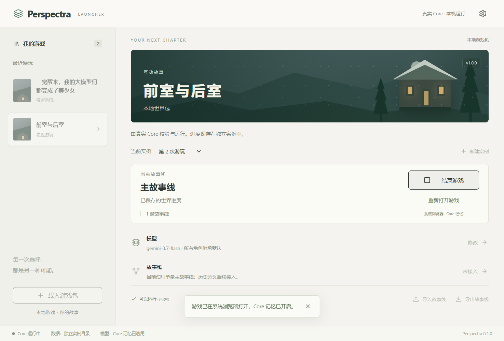

# Launcher 首轮真实 Core 接入

> 2026-10-07 更新：本文保留首轮接入时的验收记录。当前已有故事线、预设、前端授权、独立连接测试及 Windows x64 便携候选包；下文旧版“依赖本机源码”“分叉和连接测试未接入”不再描述当前版本。现状与未通过的发布门禁见 [便携候选版验收](studies/launcher-portable-release-20261007.md)。

> 本页保留 2026-10-06 首轮记录。2026-10-07 已接通本地完整节点保存、独立故事线分叉与切换；首次分叉重建 Core 记忆。当前说明与验收见[故事线](storylines.md)。分享仍未接入。

| 属性 | 内容 |
| --- | --- |
| 日期 | 2026-10-06 |
| 范围 | v5 源目录 → 独立实例 → OpenAI 兼容模型 → Core 记忆 → 系统浏览器 → 停止/续玩 |
| 用户决定 | 本轮只做上述闭环；故事线分叉与分享禁用；游戏在系统浏览器打开；启用近期优化的 Core 记忆 |
| 实际验证 | 真实模型一次玩家输入、两次角色调用；原生窗口启停/续玩；正常退出与强制退出清理 |
| 发布边界 | 当前源码工作区运行，尚未制作可独立分发的安装包 |

此前的 [V1 Mock 交付说明](launcher-v1.md) 与 [Mock 原生验收](launcher-v1-validation.md) 保留第一阶段记录。本页描述后续真实接入，不将那些示例历史视为真实 Core 数据。

## 1. 当前可用流程

在仓库根目录运行：

```powershell
# 首次准备依赖，沿用仓库已有 Node 和 pnpm
corepack pnpm@11.7.0 install --frozen-lockfile

# 原生开发窗口
corepack pnpm@11.7.0 launcher:desktop

# 或构建并运行调试程序
corepack pnpm@11.7.0 --filter @perspectra/launcher tauri build --debug --no-bundle
& '.\apps\launcher\src-tauri\target\debug\perspectra-launcher.exe'
```

本机需要 Node 24、Rust/Cargo，以及现有 Core 记忆的 Python/E5 环境；环境准备沿用 [记忆实验说明](../../experiments/activity-memory/README.md)，不重新建设运行时。Rust 的 Cargo 若未进入当前终端 PATH，重新打开终端。

首次启动显示空游戏列表。点击“载入游戏包”，选择包含 `worldpack.source.json` 的目录，例如 `examples/world-packs/ai-girls-awaken-v10`。载入时复用 v5 编译器及网页资源检查，随后创建首个独立实例。

新实例默认使用用户确认的 `http://127.0.0.1:8046/v1/chat/completions` 和 `gemini-3.7-flash`。全局设置保存新实例默认接口/模型；已有实例在自己的“模型”弹窗修改。需要认证时在设置填写 API Key：只在本次 Launcher 会话内保留，并绑定填写的接口，地址不同的实例不会自动收到该密钥。

“开始游戏”启动真实 Core 后打开系统浏览器。“结束游戏”关闭 Core，已提交进度保留；“继续游戏”重新打开同一实例。浏览器关闭不会停止 Core，Launcher 中可重新打开游戏。关闭 Launcher 会停止其拥有的游戏进程。

`launcher:dev` 仍是浏览器展示预览，不能调用原生运行命令；真实运行请使用 Tauri。

## 2. 实现与文件边界

| 文件 | 实现 |
| --- | --- |
| [desktop/launcher-core.ts](../../desktop/launcher-core.ts) | 读取/原子保存 Launcher 索引，校验包，创建实例元数据，保存模型配置，拥有游戏子进程，处理就绪与停止 |
| [desktop/launcher-entry.ts](../../desktop/launcher-entry.ts) | Tauri 与 Node 的本机 stdio 请求入口；一次串行处理一个操作；不转发私有 Core 输出 |
| [main.rs](../../apps/launcher/src-tauri/src/main.rs) | 仅 main 窗口可调用命令；启动 Node 桥接；校验本机游戏 URL 后打开浏览器；Windows Job Object 保证拥有的 Core 进程树随 Launcher 退出 |
| [Cargo.toml](../../apps/launcher/src-tauri/Cargo.toml)、Cargo.lock | JSON 通信及 Windows Job Object 所需依赖 |
| [core-types.ts](../../apps/launcher/src/core-types.ts) | 包/实例的公开 Launcher 元数据及真实状态 DTO |
| [desktop.ts](../../apps/launcher/src/services/desktop.ts) | 原生目录选择、Core 请求、浏览器打开 |
| [launcher.ts](../../apps/launcher/src/stores/launcher.ts) | 原生启动空索引，读取真实数据；阻止并发界面操作；低频刷新进程状态；会话密钥按接口隔离 |
| [types.ts](../../apps/launcher/src/types.ts) | 增加真实 Core 状态，保留此前 Mock 展示类型 |
| LauncherShell、GameList、GameDetail | 真实状态与启停；首次空状态和重试；故事线/分享明确禁用 |
| ImportDialog、ModelConfigDialog、SettingsDialog | v5 目录载入，实例模型，全局默认及会话密钥 |
| [launcher-core.test.ts](../../tests/prototype/launcher-core.test.ts) | 5 项实例索引、配置损坏、无效包、权限及认证字段回归 |
| [launcher.test.ts](../../apps/launcher/src/stores/launcher.test.ts) | 2 项原生初始化和跨接口密钥隔离回归 |

没有修改 Core 的 Action、Rulebook、Event 提交、角色权限或记忆算法；继续调用现有 `tests/experiments/playtest-web-entry.ts`。旧 Electron 桌面入口仍保留，但其存档和设置不迁移到新 Launcher。

## 3. 数据与进程

默认根目录由 Tauri 的应用数据目录提供，设置中只读显示实际路径：

```text
应用数据目录/
├─ launcher.json
└─ instances/
   └─ <本地 UUID>/
      ├─ world.sqlite
      ├─ 既有 Core 的其他存储与日志
      └─ memory-core/
```

`launcher.json` 保存包 ID、版本、路径及实际编译 Hash，实例 ID、名称、包引用、最后启动时间、实例模型，以及新实例默认模型。保存通过临时文件加 rename 完成；损坏时明确失败，不覆盖原索引。新实例仅创建索引项，首次开始游戏才初始化世界数据。

包内容不复制到实例、不由 Launcher 修改。开始游戏前复用现有只读存档预检；包 Hash 改变或不兼容时拒绝继续。实例目录只能从索引中的本地 UUID 派生，不接受前端传入任意存档路径。

API Key 不进入索引、包、参数列表或分享对象；启动时经 stdio 请求和子进程环境传给既有运行时。Core 自己管理已提交数据；Launcher 不返回角色私有 Context、记忆档案或模型正文。私有调查日志仍遵循现有运行时说明。

进程关系为 Tauri → Node 桥接 → 既有网页 Core → 按需启动的 Python 记忆进程。停止首先使用已有 IPC shutdown，超过等待期限才清理自己拥有的游戏进程树。Windows Job Object 用于 Launcher 意外退出时回收桥接及其后代，不承担未提交反应的精确恢复。

本机验收可通过环境变量 `PERSPECTRA_LAUNCHER_DATA_DIR` 指定新的实验根目录。正常用户无需设置。所有本轮实验都使用仓库 `.tmp` 中新建目录，没有写入 `D:/worlds` 或旧 Electron 存档。

## 4. 实际界面



真实实例只显示“主故事线”与“已保存的世界进度”；没有从数据库接入历史轮数，因此不显示虚构轮数。插画仍是 Launcher 的通用装饰，没有宣称从包中读取封面。

## 5. 验收记录

| 检查 | 结果 |
| --- | --- |
| AI 美少女 2.4.1 包编译校验 | valid |
| 仓库默认 check | 类型/Lint、28 文件、201 项测试通过 |
| Launcher check | strict 类型、2 文件、8 项测试通过 |
| Tauri 调试构建 | 通过，默认构建未加入调试端口 |
| 少量真实模型链路 | “前室与后室”：一次玩家输入，两次角色请求，均发表回复，网页返回 200 |
| Core 记忆 | 真实 state.debug.memoryMode = core |
| 鉴权 | 未提供网页令牌的状态请求返回 401 |
| 真实续玩 | 0 条转录 → 3 条转录；停止并以新 LauncherCore 对象重新读取实例后，仍是 3 条 |
| 原生 WebView | 实际 tauri.localhost 页面：包载入、模型保存、启停/继续、重新读取索引通过 |
| 原生目录选择 | Windows 文件夹选择返回 prototype-g1 目录，并完成前端“校验并载入” |
| 系统浏览器 | 真实 Edge 出现“Perspectra 试玩”页面；Launcher 保持独立 |
| 独立实例 | 两个包、三个本机测试实例重启后恢复；实例模型配置独立 |
| 凭证 | 原生测试值不在 launcher.json；跨接口密钥转发受回归验证 |
| 退出 | 运行中正常关闭 Launcher 后拥有的进程全部退出；运行中强制终止 Launcher 后拥有的进程也全部退出 |
| 控制台 | 原生验收无应用 error/warning；Chromium 有 password 控件的 verbose 提示 |

真实模型证据在忽略目录 `.tmp/launcher-core-smoke-result.json`，其中 providerCalls = 2、memoryMode = core、resumedTranscript = 3。本次没有触发长期记忆后台整理，因此不把这次运行描述为再次验收后台整理算法。后台整理沿用既有实现与已有验收。

原生脚本位于 `.tmp/launcher-core-verify/`；截图原始文件位于 `output/playwright/launcher-core-native-main.png` 与 `launcher-core-native-running.png`。验收用临时 WebView 调试配置不进入交付配置。

## 6. 当前接受的限制

- 当前 exe 依赖本机 Node、仓库位置、node_modules、Python 与 E5；源码工作区闭环已接通，可独立分发的安装包尚未实现。
- 只接受 v5 世界包源目录，不接受 ZIP；不自动迁移旧世界、不自动替换同 ID 的不同内容包。
- 每个实例一个主分支；历史分叉、故事线导入导出、角色独立模型映射与独立连接测试均未接入。
- 只接通 OpenAI 兼容 chat/completions；没有接入 Gemini 原生协议、Ollama 专用协议或其他认证流程。
- 全局模型变更只影响新实例；同一会话密钥按接口匹配，不保存到系统凭证库，重启需重新填写。
- 页面元数据的最后游玩时间表示最近成功启动；不等同于最后一次世界事件提交时间。
- 本次模型验证只有一轮，未重新验收连续 G3 玩法、跨地点认知隔离、后台整理高水位与长时间性能。

后续游戏前端已改为 frontend/ 显式 manifest 与 iframe 沙箱，公共玩家接口不传递 Core 令牌；详见 [前端最小沙箱实验](frontend-v1.md)。旧 web/ 的直接 API 约定不再适用。
