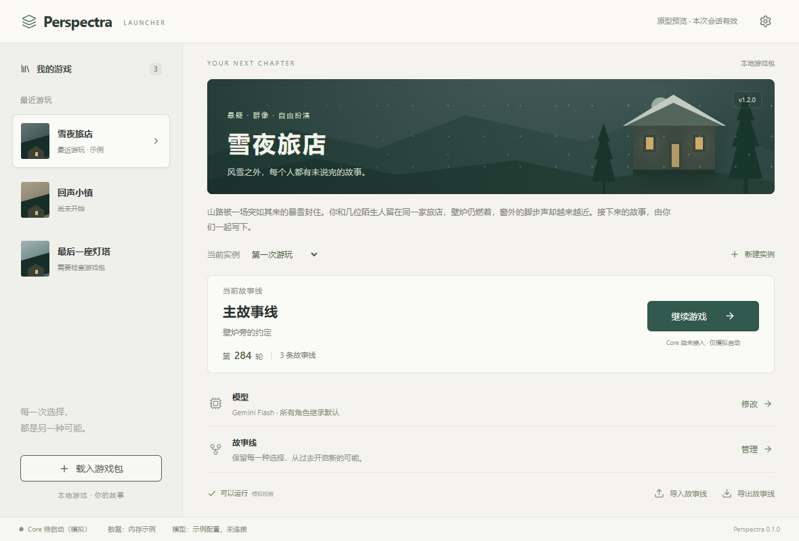
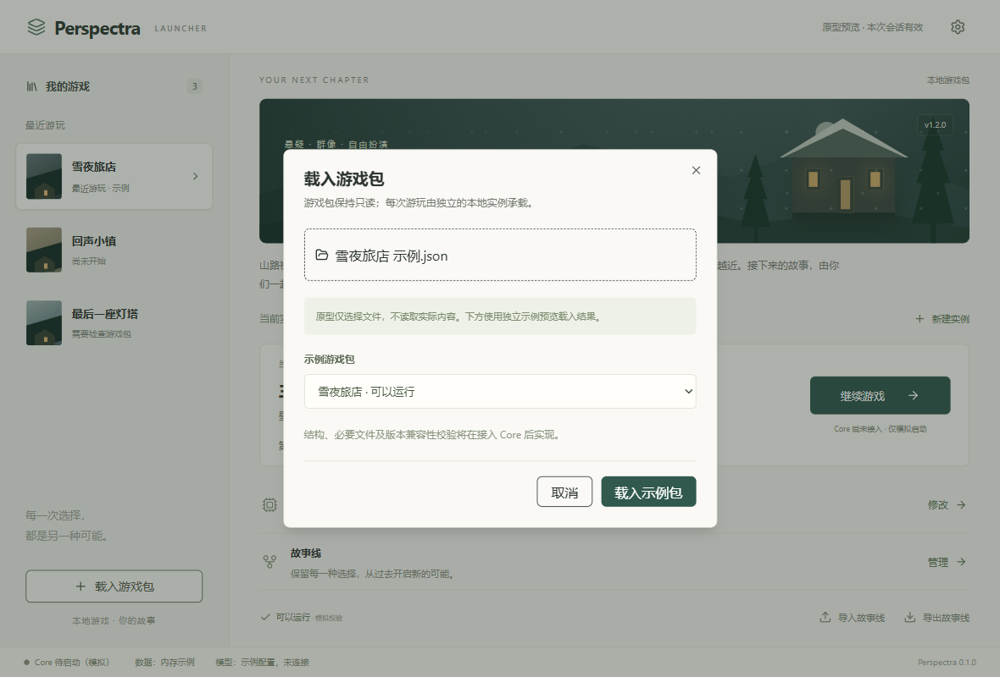

# Perspectra Launcher V1 交付说明

> 本文保留第一阶段 Mock 交付记录。后续已接通真实运行，当前能力与限制见 [首轮真实 Core 接入](launcher-core-integration.md)。

| 属性 | 内容 |
| --- | --- |
| 日期 | 2026-10-06 |
| 阶段 | 第一阶段：桌面 Launcher 骨架 |
| 实现状态 | Vue 前端、Tauri 原生构建与当前 Mock 流程已验证 |
| 技术栈 | Tauri 2、Vue 3、TypeScript strict、Vite、pnpm、Pinia、shadcn-vue、Lucide |
| 范围 | 游戏包入口、独立实例、模型配置、故事线管理、基础设置与状态 |
| 当前限制 | 数据仅在内存中；未接真实 Core、模型连接、包解析及存档读写 |
| 验证依据 | [原生验证记录](launcher-v1-validation.md)；[运行说明](../../apps/launcher/README.md) |

本文集中说明本次实现交付。功能展示、已验证行为和后续接口建议分别标明；Mock 类型不是已定稿的游戏包、存档或 Core 通信协议。

## 1. 新增和修改了哪些文件

### 1.1 新增 Launcher 工程文件

下表路径均相对于 `apps/launcher/`。第 2 节列出完整目录。

| 文件 | 作用 |
| --- | --- |
| `package.json` | Launcher 依赖与开发、检查、构建、Tauri 命令 |
| `components.json` | shadcn-vue 风格、目录别名与图标配置 |
| `tsconfig.json` | 独立 strict 类型检查，沿用显式 .ts 本地导入 |
| `vite.config.ts` | Vue、Tailwind 插件、路径别名与本地开发端口 |
| `index.html` | 中文页面入口、标题与图标 |
| `public/icon.svg` | 浏览器图标及原生图标的源图 |
| `.gitignore` | 排除 Tauri target 与生成 schema |
| `README.md` | 安装、运行、检查与实现边界 |
| `src/main.ts` | 创建 Vue 应用并注册 Pinia |
| `src/style.css` | 双栏布局、配色、风景插画、弹窗和响应式样式 |
| `src/types.ts` | 包、实例、模型、故事线、来源与状态类型 |
| `src/mock.ts` | 三个游戏包、三种模型及实例/历史示例 |
| `src/domain.ts` | 模型继承、父节点历史遍历和分享范围预览 |
| `src/domain.test.ts` | 6 项相关测试 |
| `src/stores/launcher.ts` | 一个 Pinia store，管理当前选择、实例、设置和模拟状态 |
| `src/services/desktop.ts` | Tauri 文件选择；只返回文件名，不读取包内容 |
| `src/lib/utils.ts` | shadcn-vue class 合并工具 |
| `src/components/LauncherShell.vue` | 顶栏、双栏、状态栏与弹窗入口 |
| `src/components/GameList.vue` | 左侧游戏列表与载入入口 |
| `src/components/GameDetail.vue` | 当前游戏、实例、进度、模型、故事线和启动入口 |
| `src/components/DialogFrame.vue` | 共享弹窗标题、说明和关闭行为 |
| `src/components/ModelConfigDialog.vue` | 默认模型与角色映射示例 |
| `src/components/StorylineDialog.vue` | 故事线切换、历史节点和创建新故事线 |
| `src/components/ImportDialog.vue` | 包选择和故事线示例导入 |
| `src/components/ExportDialog.vue` | 四种分享范围预览 |
| `src/components/SettingsDialog.vue` | 供应商、接口、密钥、默认模型、数据目录与显示设置 |
| `src/components/ui/button/{Button.vue,index.ts}` | shadcn-vue Button 源码组件 |
| `src/components/ui/dialog/{Dialog.vue,DialogContent.vue,DialogDescription.vue,DialogHeader.vue,DialogOverlay.vue,DialogTitle.vue,index.ts}` | 使用中的 shadcn-vue Dialog 源码组件 |
| `src/components/ui/{README.md,LICENSE}` | 组件来源、调整说明与许可证 |
| `src-tauri/Cargo.toml` | Tauri 和原生对话框插件依赖 |
| `src-tauri/Cargo.lock` | 原生依赖锁文件 |
| `src-tauri/build.rs` | Tauri 构建入口 |
| `src-tauri/tauri.conf.json` | 窗口尺寸、前端资源、构建命令、CSP 和图标配置 |
| `src-tauri/src/main.rs` | 原生窗口与文件对话框插件注册 |
| `src-tauri/capabilities/default.json` | main 窗口的基础权限及 dialog:allow-open |
| `src-tauri/icons/{32x32.png,128x128.png,128x128@2x.png,icon.png,icon.ico,icon.icns}` | 从同一 SVG 生成的桌面图标 |

shadcn-vue 采用本地源码组件，只保留所需的 Button 和 Dialog；Lucide 使用 `@lucide/vue`。没有引入路由、SSR、ORM、在线账号、自动更新或 Studio。

### 1.2 仓库配置与文档

| 路径 | 状态 | 本次用途 |
| --- | --- | --- |
| [package.json](../../package.json) | 修改 | 新增 launcher:dev、launcher:build、launcher:desktop、launcher:check |
| [pnpm-workspace.yaml](../../pnpm-workspace.yaml) | 修改 | 将 apps/* 加入现有工作区 |
| [pnpm-lock.yaml](../../pnpm-lock.yaml) | 修改 | 锁定 Launcher 新增依赖 |
| [docs/current/architecture/README.md](architecture/README.md) | 修改 | 添加 Launcher 文档入口 |
| `docs/current/launcher-v1.md` | 新增，随后整理为本文 | 集中交付说明 |
| [docs/current/launcher-v1-validation.md](launcher-v1-validation.md) | 新增 | 原生验收场景、结果、证据与限制 |
| `docs/current/assets/launcher-v1/main.png` | 新增 | 主界面截图 |
| `docs/current/assets/launcher-v1/native-file-selection.png` | 新增 | 原生选择文件后返回 Launcher 的截图 |

本次没有修改 `desktop/`、Core 的 `packages/`、既有测试业务逻辑或历史试玩数据。工作区中另有 `examples/world-packs/tavern-social/text/opening.zh-CN.md` 的修改，不属于本次 Launcher 交付。

本机另经授权安装 Rust/Cargo 1.99.0 stable MSVC 最小工具链，用户 PATH 已注册。调试可执行程序位于 `apps/launcher/src-tauri/target/debug/perspectra-launcher.exe`；构建目录、WebView 测试配置、脚本和临时日志属于被忽略的本地产物，不作为源码文件提交。

## 2. 当前 Launcher 的目录结构

```text
apps/launcher/
├─ .gitignore
├─ README.md
├─ package.json
├─ components.json
├─ tsconfig.json
├─ vite.config.ts
├─ index.html
├─ public/
│  └─ icon.svg
├─ src/
│  ├─ main.ts
│  ├─ style.css
│  ├─ types.ts
│  ├─ mock.ts
│  ├─ domain.ts
│  ├─ domain.test.ts
│  ├─ lib/
│  │  └─ utils.ts
│  ├─ services/
│  │  └─ desktop.ts
│  ├─ stores/
│  │  └─ launcher.ts
│  └─ components/
│     ├─ LauncherShell.vue
│     ├─ GameList.vue
│     ├─ GameDetail.vue
│     ├─ DialogFrame.vue
│     ├─ ModelConfigDialog.vue
│     ├─ StorylineDialog.vue
│     ├─ ImportDialog.vue
│     ├─ ExportDialog.vue
│     ├─ SettingsDialog.vue
│     └─ ui/
│        ├─ README.md
│        ├─ LICENSE
│        ├─ button/
│        │  ├─ Button.vue
│        │  └─ index.ts
│        └─ dialog/
│           ├─ Dialog.vue
│           ├─ DialogContent.vue
│           ├─ DialogDescription.vue
│           ├─ DialogHeader.vue
│           ├─ DialogOverlay.vue
│           ├─ DialogTitle.vue
│           └─ index.ts
└─ src-tauri/
   ├─ Cargo.toml
   ├─ Cargo.lock
   ├─ build.rs
   ├─ tauri.conf.json
   ├─ capabilities/
   │  └─ default.json
   ├─ src/
   │  └─ main.rs
   └─ icons/
      ├─ 32x32.png
      ├─ 128x128.png
      ├─ 128x128@2x.png
      ├─ icon.png
      ├─ icon.ico
      └─ icon.icns
```

组件负责界面，一个 store 管理会话状态，`domain.ts` 只承载 Launcher 的少量展示逻辑，`services/desktop.ts` 集中原生文件选择。没有重建 Core 业务层。

在仓库根目录运行：

```powershell
# 浏览器开发预览：http://127.0.0.1:1420
corepack pnpm@11.7.0 launcher:dev

# Launcher 类型检查与相关测试
corepack pnpm@11.7.0 launcher:check

# 前端生产构建
corepack pnpm@11.7.0 launcher:build

# Tauri 原生开发窗口
corepack pnpm@11.7.0 launcher:desktop

# 可直接启动的原生调试程序，不生成安装包
corepack pnpm@11.7.0 --filter @perspectra/launcher tauri build --debug --no-bundle
```

根目录原有 `check` 不扫描 apps，Launcher 应单独运行 `launcher:check`。现有 Electron 的 `desktop` 命令仍指向旧试玩入口。

## 3. 主界面实现效果

### 3.1 双栏主界面



这张截图来自浏览器预览；原生 Tauri 使用同一份前端，已在实际 WebView2 中完成交互验证。

界面采用暖灰背景、深绿色主按钮和静态风景插画。左侧为游戏选择，右侧集中管理当前游戏，没有大型导航菜单或管理后台仪表盘。

| 区域 | 当前内容 |
| --- | --- |
| 顶栏 | Perspectra、原型状态提示、右上角全局设置 |
| 左栏 | 游戏列表、最近游玩提示、载入游戏包 |
| 游戏详情 | 名称、版本、简介、当前实例、新建实例 |
| 当前故事 | 故事线名称、节点标题、轮数、故事线数量、来源 |
| 主要操作 | 继续/开始游戏，运行时可结束模拟会话 |
| 配置入口 | 模型修改、故事线管理 |
| 分享入口 | 导入故事线、导出范围预览 |
| 底栏 | Core 模拟状态、内存数据状态、模型示例状态 |

默认展示“雪夜旅店” v1.2.0、“第一次游玩”、Gemini Flash、“主故事线”、第 284 轮和三条故事线。这里的三条包括主线和两条衍生线路，不能表述为“三个额外分支”。

### 3.2 弹窗与原生文件选择

模型弹窗默认只显示一个模型；打开角色单独配置后，才出现角色组及角色专属配置。故事线弹窗支持切换线路、查看历史，以及从选中节点创建新线路。设置没有首次启动向导，连接测试也不强制执行。



实际 Windows 文件对话框已经验证：可取消、可选择中文及空格文件名，返回后只显示文件名。当前阶段不会读取所选包内容；下方“载入示例包”仍用于独立的 Mock 演示。

### 3.3 实际验证与完成度

| 项目 | 当前结论 |
| --- | --- |
| 严格类型检查、Vite 前端构建 | 通过 |
| Launcher 相关测试 | 6 项通过 |
| 仓库默认检查 | 类型、Lint、27 个测试文件 / 196 项测试通过 |
| 原生 Tauri 构建 | 通过；已生成调试 exe，未生成安装包 |
| 实际 WebView2 界面流程 | 模型配置、故事线、示例导入、导出预览、设置、模拟启停通过 |
| 原生文件对话框 | 取消及选择通过，原文件内容保持不变 |
| 密钥与权限 | password 遮罩、测试值未进入 Web 存储、未授权保存命令被拒绝 |
| 退出行为 | 测试应用及其 WebView2 浏览器子进程正常退出 |
| 交付配置 | 临时调试配置已撤除，默认程序重建并复核，无测试调试端口 |
| 尚未验证 | 真实 Core、模型、游戏包解析、存档、系统 DPI 缩放和安装包 |

尺寸检查在 WebView viewport 的 1180/800/600px 宽度进行，没有证明全部操作系统缩放组合。原生交互通过表示当前 GUI 骨架可用，不表示真实角色玩法已经验收。详细场景和本地证据见 [原生验证记录](launcher-v1-validation.md)。

## 4. 当前 Mock 数据结构

类型定义见 [types.ts](../../apps/launcher/src/types.ts)，示例内容见 [mock.ts](../../apps/launcher/src/mock.ts)，会话操作见 [launcher.ts](../../apps/launcher/src/stores/launcher.ts)。

### 4.1 基础对象

| 类型 | 关键字段 | 当前语义 |
| --- | --- | --- |
| GamePackage | id、version、title、description、recommendation、validation | 只读包元数据；不包含可执行世界定义 |
| PackageValidation | status、issues、simulated | ready / degraded / blocked 三态结果，全部模拟 |
| ModelRecommendation | capability、contextTokens、toolCalling | 作者描述能力需求，不指定供应商 |
| ModelProfile | id、label、providerId、model、能力字段 | 本地模型条目；当前全部示例 |
| ModelConfiguration | defaultModelId、overridesEnabled、groups、characters | 每个实例独立配置；角色映射默认关闭 |
| CharacterModelMapping | groups、characters | 角色组/角色 ID 到本地模型 ID 的映射 |
| ProviderSettings | id、label、endpoint、apiKey | 私有接口配置，与分享对象分开，仅保存在内存 |
| GameInstance | id、packageId、packageVersion、name、model、currentStorylineId、storylines、nodes、lastPlayedAt、localSettings | 独立游玩实例 |
| StoryNode | id、parentNodeId、turn、title、summary、createdAt | 不可变历史链接和展示摘要，不是世界事件或快照 |
| Storyline | id、name、parentStorylineId、parentNodeId、currentNodeId、source | 一条故事线路的名称、当前位置与来源 |
| StorylineSource | kind、label、storylineId、nodeId、turn | original / local / shared 来源及起始关系 |
| CoreStatus | state、mode，运行时关联实例/线路；异常时带 message | idle / running / error，mode 当前固定为 mock |
| StorylineShare | prototype、packageId、packageVersion、scope、storylineId、currentNodeId、storylines、nodes、modelReference | 分享范围占位，不是正式存档文件格式 |

`ExportScope` 预留 `current-node`、`storyline`、`branch`、`tree`。当前只展示范围与节点数量，不生成可继续游戏的文件。分享预览采用明确字段构造，没有序列化整个 store，模型参考只保留能力建议。

### 4.2 默认数据与关系

| 包 ID | 游戏 | 版本 | 校验示例 |
| --- | --- | --- | --- |
| snow-inn | 雪夜旅店 | 1.2.0 | 可以运行 |
| quiet-town | 回声小镇 | 0.8.2 | 可以运行但可能降级：可选环境音缺失 |
| last-light | 最后一座灯塔 | 0.3.0 | 无法运行：必要世界定义缺失 |

初始 store 为每个游戏创建一个实例。雪夜旅店使用完整历史示例；另外两个实例从第 0 轮开始。同一个包可新建多个实例，每个实例有自己的模型配置和线路。

雪夜旅店的历史节点关系为：

```text
第 0 轮：抵达旅店
└─ 第 80 轮：一封迟到的信
   ├─ 第 173 轮：告诉她真相
   │  └─ 第 284 轮：壁炉旁的约定
   └─ 第 96 轮：离开小镇
```

主故事线当前指向第 284 轮，“告诉她真相”指向第 173 轮，“隐瞒真相”指向第 96 轮。从第 80 轮再创建线路，只增加新的 Storyline，不删除节点或改写原线路。

模型配置的初始值：

```ts
{
  defaultModelId: 'flash',
  overridesEnabled: false,
  groups: {},
  characters: {}
}
```

示例模型为 Gemini Flash、Gemini Pro 和 GPT。它们的 API slug、上下文长度和能力值是 Mock 元数据，不是已核验的供应商规格。开启映射后按“角色专属 > 角色组 > 默认”解析；关闭时全部继承默认。

示例故事线导入生成新实例，并把选中线路设为第 173 轮、来源设为示例玩家。用户可查看其过去并创建自己的线路；模型使用本地默认值重新映射。实例 ID 由本次会话生成，不提供持久化或跨设备 ID 承诺。

### 4.3 有意识接受的限制

退出或刷新后实例、故事历史、设置和密钥全部清空。全局数据目录是占位字段，不会创建目录；模型连接测试不发送请求；Core 启动只改变模拟状态。真实包校验、世界快照、自动/手动存档和故事线文件导入导出均未实现。

角色组和角色名是界面示例，尚未从真实包定义读取。当前 Node 的标题、摘要与模型映射也不能直接充当 Core 的权威事实或角色私有上下文。

## 5. 后续接入真实 Perspectra Core 时建议的接口边界

采用 Vue/Pinia → Tauri → Core 的分工。下表是操作边界建议，不是要求立即建设的新协议或抽象框架。

| 操作 | Vue / Pinia | Tauri 外壳 | Perspectra Core |
| --- | --- | --- | --- |
| 载入与校验包 | 发起选择、展示摘要及三态结果 | 选择本地路径，提供必要的只读访问 | 复用 world-pack 编译/校验，判断内容及版本能否运行 |
| 创建与列出实例 | 名称、包版本、模型选择与当前实例 | 管理独立可写实例目录 | 初始化/读取实例，返回可公开的元数据 |
| 模型配置与测试 | 展示本地模型、继承选择及测试结果 | 保管私有认证，受控访问所配置接口 | 按角色映射使用模型，报告玩法所需能力是否满足 |
| 启动与结束游戏 | 请求指定实例/线路，展示运行或错误状态 | 启停 Core 进程，接收 ready/error，打开游戏前端 | 执行真实游戏、角色激活和规则裁定 |
| 历史与新故事线 | 展示授权历史，请求从选定节点开始 | 转发请求，不直接复制或改写数据库 | 返回公开历史，在一致世界状态上创建新线路，保留原未来 |
| 分享 | 选择范围、查看来源、重新映射模型 | 文件选择与保存经脱敏的分享数据 | 定义实际快照/历史载体，验证导入，初始化新的本地实例 |
| 诊断 | 正常时显示简单状态，异常时显示原因 | 脱敏进程及系统错误 | 提供允许公开的运行错误，不泄露角色私密认知或认证 |

[services/desktop.ts](../../apps/launcher/src/services/desktop.ts) 当前只有文件选择，可在下一阶段承载最小原生操作；[src-tauri/src/main.rs](../../apps/launcher/src-tauri/src/main.rs) 当前只注册对话框插件。没有已实现的 Core 启动命令、事件订阅或文件读写接口。

接入时必须维持以下边界：

- 原始游戏包只读，运行数据写入独立实例目录；不复用历史试玩目录做实验。
- Launcher 无权提交 World Event Log；重要世界事实仍由 Core 的 Action / Rulebook / Event 路径裁定。
- 历史节点创建线路必须依据 Core 的实际状态，不能只移动 GUI 指针来声称世界已经回退。
- UI 只接收公开元数据与允许查看的历史，不能接收所有角色的私有上下文。
- 本地认证、私人接口与路径不进入分享对象或诊断输出；正式导出仍需定义公开字段，不能据 Mock 测试声称任意文本均已脱敏。
- 真实世界 ID、WorldAddress 和事件引用复用 Core 类型；当前字符串 ID 仅是 Launcher 示例元数据。
- CoreStatus 的 mock 分支须在接入时由真实状态替换；是否增加新的状态，应由实际启动行为决定。

下一步最小接入建议是“一份现有世界包 → 一份新实例目录 → 一个真实 Core 进程 → 一个游戏前端”的闭环。先复用既有包校验和运行机制；历史分享及旧数据迁移按实际需求分别接入。

## 6. 是否发现现有仓库中与该方案冲突的架构问题

**没有发现阻止第一阶段 GUI 原型的核心冲突，但已有入口与新 Launcher 的接入语义存在差异。** 以下结论来自当前源码，不将 Mock 的可见行为视为 Core 能力已经实现。

| Evidence：现有证据 | Finding：实际差异 | Path：建议处理 |
| --- | --- | --- |
| [desktop/main.ts](../../desktop/main.ts) 使用 Electron；新入口位于 apps/launcher/src-tauri | 两种桌面外壳并行，旧 desktop 命令不会启动新 Launcher | 当前保留可试玩旧入口，使用独立 launcher 命令；真实接入后再决定旧壳是否退役 |
| desktop/main.ts 的 launchBackend 直接运行 [tests/experiments/playtest-web-entry.ts](../../tests/experiments/playtest-web-entry.ts)，并传递实验 tuning | 当前桌面启动边界依赖实验代码，不宜直接成为新 Launcher 的完整业务 API | 接入时提取最小正式运行入口，复用现有 Core，不复制实验控制面板 |
| desktop/main.ts 的 SaveInfo、LaunchRequest、savesRoot 按 saves 和 saveId 组织 | 新 UI 采用“包 → 实例 → 故事线”，无法直接把旧 saveId 视为完整故事线关系 | 先确定实际需要保留的数据及映射，再选择迁移、明确不兼容或有限复用 |
| [branch-operation-coordinator.ts](../../packages/application/src/branch-operation-coordinator.ts) 暴露 forkAtHead，并读取父分支 headSeq | 已读协调入口从当前头创建分支；没有据此证明 Launcher 的“任意历史节点开始”已接通 | 下一阶段核对历史节点与可恢复世界状态，扩展或复用最小必要路径；本次仅实现内存线路关系 |
| [prototype-contract.md](prototype-contract.md) 的首次实验范围是单世界分支 | 用户本次明确要求的多故事线 UI 超出原契约首轮运行范围 | 本文记录 Launcher 范围扩展；保留权限和事实约束，不宣称多故事线 Core 或分享已验收 |
| 根目录 tsconfig/check 仍面向 packages、tests、desktop | 默认门禁通过并不覆盖新 apps/launcher | 使用 launcher:check 和 Launcher 构建；需要统一 CI 时再明确纳入 |
| 当前 types.ts 是前端摘要类型，StorylineShare 标为 prototype | 与 Core 的品牌 ID、完整地址和可执行存档不是同一个模型 | 正式接入复用 Core 类型和数据，不把占位分享对象升级为正式协议 |

这些差异当前通过独立目录、独立命令和明确 Mock 标识控制，没有修改旧运行时来强行适配。本阶段没有建立旧存档兼容分支，也没有迁移用户数据。

完整世界编辑、角色编辑、活动编排、记忆编辑、账号、社区、商店、云存档和插件市场继续不属于 Launcher 第一阶段范围。
