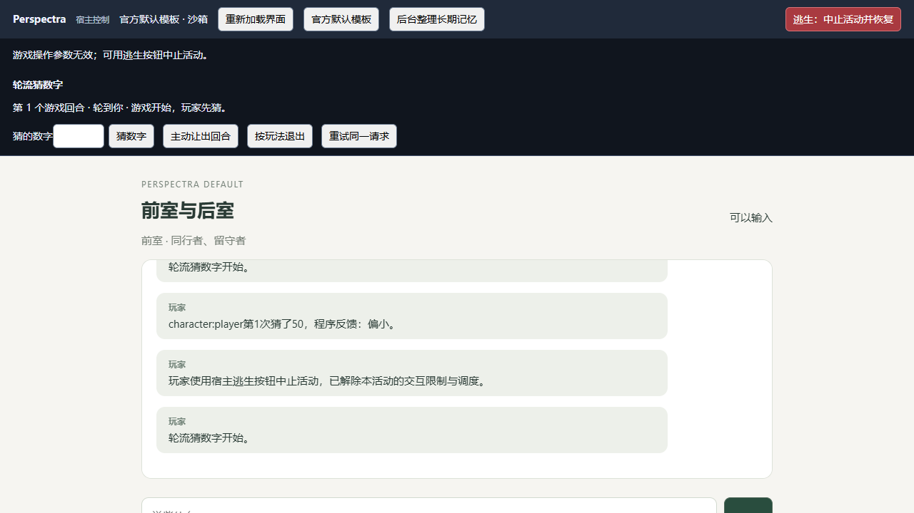
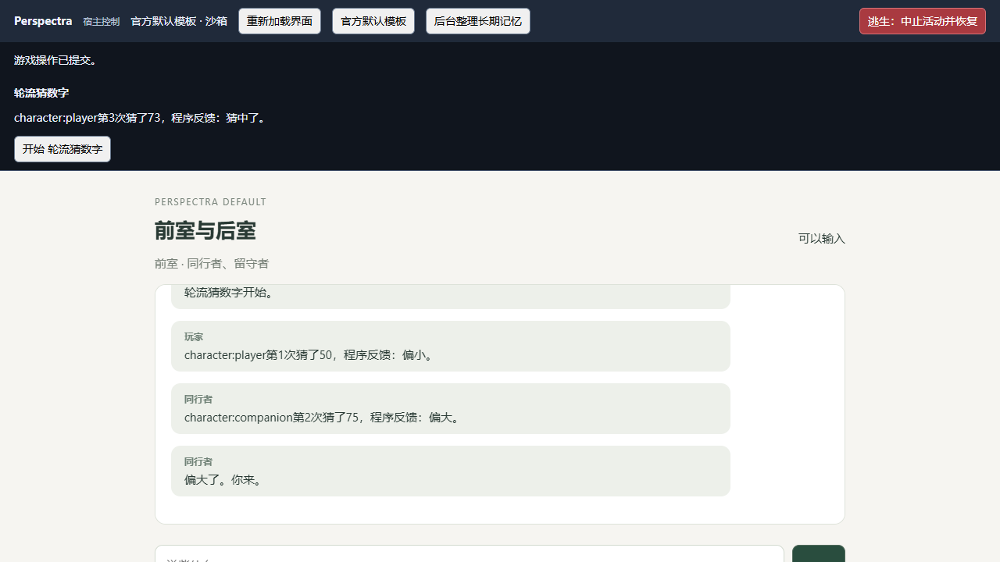

# 四项试玩问题修复与复测（2026-10-07）

## 1. 结果

四项修复已落地。默认检查 37 个文件、259 项测试通过；Launcher 类型检查及 10 项测试通过；正常 Tauri debug 构建通过。

真实模型复测使用 `http://127.0.0.1:8046/v1/chat/completions` / `gemini-3.7-flash`。最终小游戏中：玩家猜 50，NPC 首次输出非法，唯一一次自动修正输出通过严格校验，NPC 猜 75 并正常返回玩家回合，玩家猜 73 后结束。临时测试包固定答案 73，以便有限步骤检查结束路径；答案仍只留在活动内部状态，没有注入角色上下文；测试脚本知道该答案用于检查结束路径，仍经正常游戏裁定。

测试全部使用 `.tmp/launcher-four-fixes-20261007/` 隔离数据，不修改历史试玩存档。最终临时服务与浏览器已关闭；普通 Launcher 构建保留，不带调试端口。

## 2. 修复内容

| 问题 | 实现 | 验证 |
|---|---|---|
| 赠送选项冲突 | 交互 ID 为 `opt:` + 完整 SHA-256；输入是规范化完整动作，含定义版本、目标、bindingId、arguments；显示收件人名称 | 对象及嵌套字段顺序变化 ID 不变；不同收件人/版本 ID 不同；第二项确实传给第二收件人；当前选项消失后拒绝 |
| NPC 活动卡轮 | 严格 Core schema 校验；最多一次格式修正；修正请求限定模型已选且能唯一匹配的分支/交互选项；数字常量用等价数值上下界表达 | 本机 tool 与 Ollama format 两条模拟路径均验证非法首次、合法第二次只提交一次；两次均非法不推进；真实模型修正成功并完成一局 |
| 错误提示被覆盖 | 宿主页 `currentNotice={type,operation,content,sequence}`，统一写入与渲染；普通状态刷新不覆盖操作通知 | 真实页面提交 0，错误及序号经过 3.1 秒和自动刷新仍保持；随后合法操作清除错误并显示结果 |
| 字体偏好丢失 | 现有 `launcher.json.preferences.largeText` 保存；设置入口与快照恢复；旧配置缺失字段默认 false | 磁盘重建测试、错误类型拒绝、凭证不落盘；原生窗口恢复 true，经 UI 改为 false 保存，正常重启仍 false |

移动选项仍沿用现有 ID；本轮修正的是带参数的交互选项身份。optionId 不承担授权作用，执行继续从当前可用选项解析动作。实体没有显示名时使用实体 ID，不硬编码示例包名称；角色显示名只筛选当前可用选项引用，不公开全角色名单。

## 3. 真实接口发现与边界

Core 的决策 schema 使用严格分支；当前本机 Gemini 网关入口另有既存扁平适配。这使首次输出容易混合 perform 与 speech。直接校验扁平 wire schema 不足，活动校验必须使用 Core schema。

实际复测还观察到 version/revision 的 numeric const 多次得到字符串输出，单纯格式提示不能稳定修正。最终修正请求消除能唯一识别的联合分支，并以相等 minimum/maximum 表达固定数字；原始严格 schema 继续用于校验。最终输出的 version 为数字 1，revision 为数字 2。这里记录的是 wire 形式与实际输出的关联，未逆向或证明网关内部转换实现。

- 不自动删除 speech，不自动把字符串数字转换成数字，不增加受控动作预算。
- 每次活动决策最多额外一次模型调用；可能增加费用和等待时间，不表示任意模型都能一次修正成功。
- 两次都非法，保留当前轮次，显示格式失败，继续提供重试与逃生；传输失败不触发格式重试。
- 返回后继续原有世界高水位、活动版本、权限及事务检查；调用取消仍终止未完成操作。
- 修正可以窄化模型自己已选的合法决策类型和唯一交互选项，不由宿主预先指定角色策略。无法唯一匹配时保留原请求形式，不猜测选项。
- 此处理仅接通活动调用，不声明通用 G2、所有预设和所有模型的格式兼容已经完成。

通知序号仅用于页面内通知排序，与世界事件无关，不持久化，也没有新增请求乱序状态机。普通状态轮询不覆盖当前操作结果；新操作明确开始时清除旧通知。

## 4. 修改文件

实现：

- `packages/frontend/src/player-view.ts`：规范化哈希与赠送文字。
- `tests/experiments/playtest-server.ts`：当前选项显示名称的内部状态字段。
- `tests/experiments/playtest-frozen-runtime.ts`：仅筛选当前选项引用的角色名；接入格式修正；区分格式/服务失败提示。
- `tests/experiments/pack-activity.ts`：一次 schema 格式修正及兼容 wire 表达。
- `packages/application/src/prototype-character-turn.ts`：格式异常与传输异常的失败分类。
- `tests/experiments/playtest-host-page.ts`：统一操作通知。
- `desktop/launcher-core.ts`：字体偏好持久化及读取校验。
- `apps/launcher/src/core-types.ts`、`stores/launcher.ts`、`components/SettingsDialog.vue`：设置保存与快照恢复。

回归：`tests/prototype/frontend-api.test.ts`、`pack-activity.test.ts`、`launcher-core.test.ts`。

现行文档：`docs/current/frontend-v1.md`、`architecture/creator-runtime.md`；原试玩报告补充本修复记录链接。工作区既有其他未提交改动保留。

## 5. 验证命令与限制

```text
corepack pnpm@11.7.0 check
37 个文件、259 项测试通过；类型与 Lint 通过。

corepack pnpm@11.7.0 launcher:check
Launcher 类型与 10 项测试通过。

corepack pnpm@11.7.0 test:related tests/prototype/pack-activity.test.ts tests/prototype/frontend-api.test.ts tests/prototype/launcher-core.test.ts
相关路径 36 项通过；随后完善 wire 断言的最终版本已包含在默认检查中。

corepack pnpm@11.7.0 --filter @perspectra/launcher tauri build --debug --no-bundle
正常原生构建通过。
```

本轮没有重新执行上一份报告的所有模块完整试玩；重点覆盖四项缺陷和相应失败边界。赠送的第二收件人验证为当前投影/执行代码回归，未另做真实存档赠送；真实模型验收为本机短局，不覆盖其他网关、长期运行和大型原包。

## 6. 实际页面



