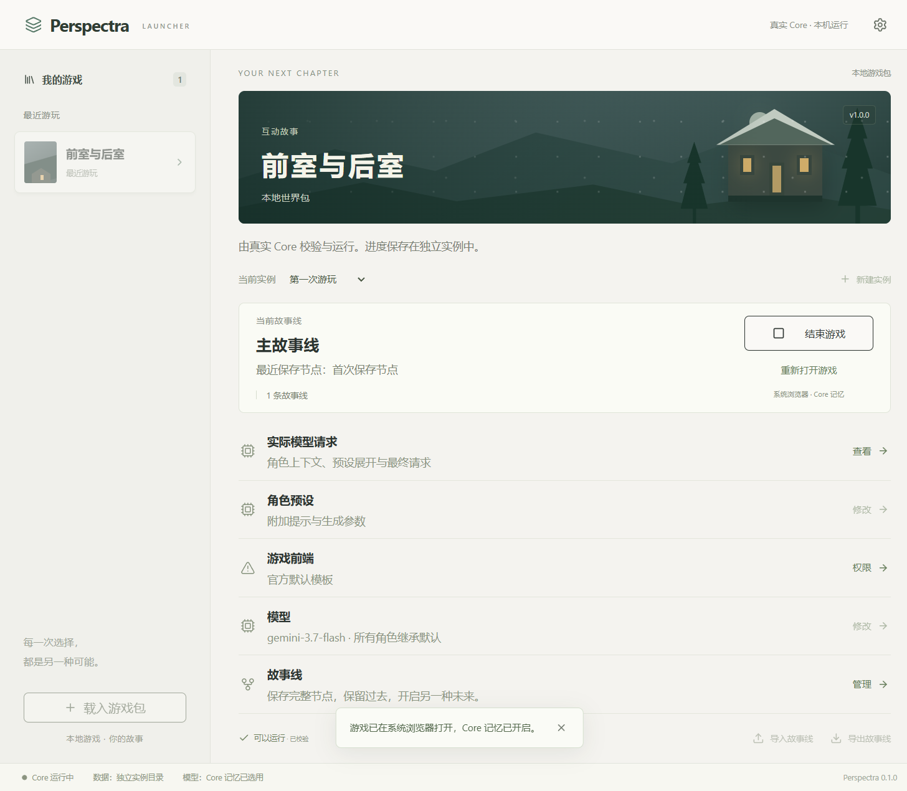
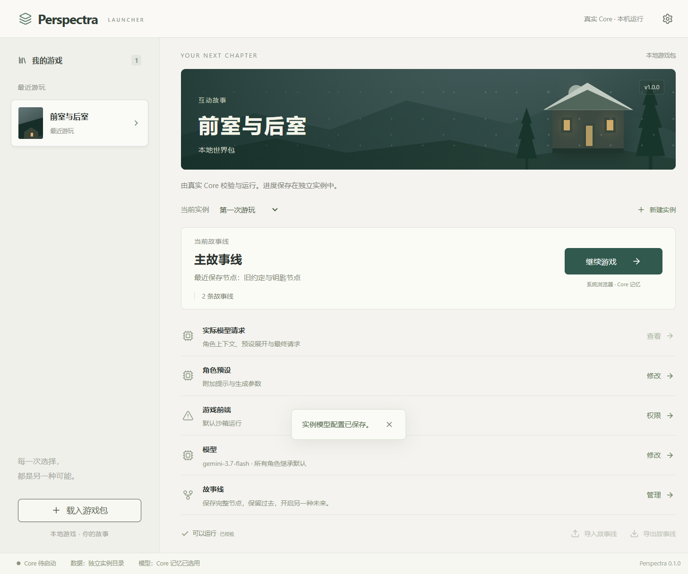

# Launcher 完整真实试玩报告（2026-10-07）

## 1. 结论

已从 Windows 原生 Launcher 出发，经过系统目录选择器、模型配置、系统浏览器游戏页、真实角色交互、记忆整理、故事线分叉，再回到 Launcher 完成授权撤销和退出重启。

主要路径可运行，但发现四个问题：赠送行动标识冲突、真实模型小游戏输出导致卡轮、活动拒绝反馈被覆盖、较大文字设置重启后丢失。前两项影响主要体验，不能以自动化测试通过代替验收。

本轮只进行了测试、临时实验与报告记录，没有修改业务实现。工作区原有未提交修改保留。

## 2. 环境与测试方法

- 原生 Tauri Launcher / WebView2；游戏通过 Launcher 实际打开系统 Microsoft Edge。
- 模型：`gemini-3.7-flash`；接口：`http://127.0.0.1:8046/v1/chat/completions`。确实进行了真实调用，未打印或写入报告任何凭证。
- 使用全新隔离数据目录 `.tmp/full-launcher-playtest-20261007/launcher`，没有改动历史试玩存档。
- 测试包基于 `prototype-g1`，两间房、玩家和两名角色、钥匙及保温杯；加入现有 AI Girls 包的变量与活动脚本、推荐预设。社区前端阶段使用其现有前端，并加入本地非破坏性隔离探针。
- 游戏包初始摘要：`sha256:7c96102a2c35e16966fff2a6f3c4494bbd01fc823f47a11d10a88ac00ca63c6d`。
- Launcher 按钮、表单和弹窗通过真实 WebView 自动化操作；系统文件选择器与实际游戏页通过 Windows UI Automation 操作。内部只读快照、SQLite 与脱敏请求记录用于核对实际状态，不代替主要 UI 操作。
- 临时 WebView 调试构建仅用于本次测试；结束后重新生成不带调试配置的正常 Launcher 构建。

## 3. 模块覆盖与结果

| 模块 | 实际操作及核对 | 结果 |
|---|---|---|
| 包与实例 | 系统目录选择器加载包，校验并创建实例；再创建第二实例 | 通过；第二实例不继承首实例角色组与授权 |
| 模型配置 | 全局默认、实例模型；错误的 `/v1` 地址提交，再改回完整地址 | 通过；错误提示明确，未覆盖正确配置；真实调用成功 |
| 预设 | 全局提示、包推荐、实例内角色组、角色专属提示及参数、宏节点；保存及重启 | 配置保存通过；真实请求记录可检查；不把短局对白当成提示风格的全面验收 |
| 预设库 | 草稿另存命名预设、实际文件导出、重新导入 | 通过；形成不同名称的副本，原角色 temperature 0.3 未改变 |
| 请求检查器 | 开启采集，查看真实角色请求与活动失败记录 | 通过；私密上下文未写入公共测试报告 |
| 默认前端 | 发言、动作按钮、角色回应、移动、取物、丢物、握手与解除 | 主路径通过；赠送选项存在标识冲突，见问题 1 |
| 角色主体性 | 普通互动中角色自主移动，随后核对位置与对白 | 行为自然；世界记录与位置变化一致 |
| 活动/小游戏 | 开始猜数字、非法数值、正常玩家猜测、NPC 轮次、重试、逃生 | 玩家步骤可提交；NPC 首次与重试均格式失败；逃生恢复自由互动 |
| 包变量 | 修改公开剧情阶段，分叉与恢复时核对 | 通过；原线未来与历史节点的变量状态不同且正确恢复 |
| Core 记忆 | 后台整理时继续发言/改变世界；等待完成；另一轮即时取消 | 通过；完成与取消提示正确，取消不清空已安装档案 |
| 认知隔离 | 让两名 NPC 留在后室，玩家前室独处说暗号，再回去询问 | 两名角色均回答未听到；后续角色请求上下文未包含该暗号 |
| 故事节点/分叉 | 保存旧约定节点，推进原线并丢钥匙、改变量；停止后从节点新建故事线 | 通过；分叉还原旧钥匙归属、变量与截至节点的记忆 |
| 原线继续 | 切回主线并继续 | 通过；原线后续进度保留，没有被分叉覆盖 |
| 社区前端 | 默认 iframe 沙箱、真实发言、显式确认后受信任模式 | 两种模式均可操作；未经确认按钮不可授权 |
| 权限与撤销 | 运行中撤销，重新授权后改前端内容；第二实例检查授权 | 通过；撤销切回默认页、不改世界；内容变化使旧授权失效；新实例不继承 |
| 生命周期 | 结束/继续、多次切换故事线；正常退出 Launcher、重启 | Core 未遗留；实例/故事线/模型/角色组保留；字体偏好丢失，见问题 4 |

“独处暗号”与此前旧约定是不同证据。旧约定说出时两名 NPC 同处一室，不能据此指控认知泄漏。

## 4. 故事线与记忆的状态证据

| 检查点 | 世界序号 | 钥匙 | 公开剧情阶段 |
|---|---:|---|---|
| 保存旧节点 | 130 | 玩家持有 | 初见 |
| 原线推进完成 | 266 | 后室地上 | 原线未来 |
| 从旧节点分叉 | 130 | 玩家持有 | 初见 |
| 切回原线继续 | 266 | 后室地上 | 原线未来 |
| 社区前端交互后、撤销前 | 282 | 后室地上 | 原线未来 |
| 运行中撤销后 | 282 | 后室地上 | 原线未来 |

分叉中两名角色记忆档案的 `asOfWorldSeq` 均为 130；档案不含原线未来的秘密或独处暗号。真实询问旧约定时，角色回忆了旧暗号，没有把原线后续暗号带到分叉。

原线独处暗号测试中，两名角色后续请求均未包含未观察到的暗号，两名角色对白也承认不知道。这是本次有限场景的行为与上下文验证，不是任意自然语言永不泄漏的证明。

## 5. 发现的问题

### 问题 1：赠送选项 ID 冲突，第二个选项可能仍赠送给第一个角色（P1）

**现象：** 同场两名 NPC 时，默认前端出现两个相同的 `base:give · entity:brass-key` 按钮，无法从文字识别收件人。

**定位：** `packages/frontend/src/player-view.ts:24` 只以目标 ID 与 bindingId 构造 optionId，没有包含收件人等选项参数；执行端以 ID 查找第一个匹配项。

**复现：** 用当前实际投影与执行函数构造两个赠送选项，仅 recipientId 不同。选择第二项的 ID 后，执行结果仍是 `character:companion`，而第二项预期是 `character:friend`。两项 ID 完全相同。该最小函数复现与 UI 上观察到的重复赠送选项相互对应；本轮没有在真实存档中另执行一次错误赠送来改变物品归属。

**影响：** 公共玩家接口的选择不能唯一对应完整动作；官方和社区前端都受影响。世界裁定仍执行合法赠送，但玩家选择的对象可能错误。

**建议：** 小范围修正选项标识以区分完整选择，并显示接收角色名称；补充两名收件人的最小回归用例。优先级最高。

### 问题 2：当前真实模型无法完成猜数字 NPC 轮次，重试仍卡住（P1）

**现象：** 玩家输入 50 后成功提交猜测，进入 NPC 回合，页面显示角色模型未完成有效操作；点击再次请求角色处理仍失败。逃生可以恢复自由互动。

**证据：** 两次请求都返回了 `decision: perform` / `actionType: interact` / `activity:guess`，但额外混入 `speech`，第一次还混入 `addresseeIds`。传输正常，活动校验拒绝混合输出。

**定位：** `tests/experiments/pack-activity.ts:185-198` 的 perform 分支只接受 `decision/actionType/parameters`。调用端已经提供分支 schema，不能归因为“没有 schema”。当前模型/网关的实际输出未遵守该分支，既有失败处理保留了停轮状态。

**影响：** 这套实际接口与模型下，小游戏主路径本轮未通过；玩家提交的有效猜测保留，NPC 没有被伪装成主动让出，也未发现部分世界提交。

**建议：** 优先检查该模型/网关的结构化输出遵循情况，以及现有格式失败处理。保持活动权限与裁定边界；不要为通过试玩直接放开混合输出。结论仅适用于本次模型与两次请求，不外推到所有模型。

### 问题 3：非法活动输入的拒绝原因被旧成功提示覆盖（P2）

**现象：** 提交范围外的数值 0 后，活动没有推进，但页面快速恢复为旧的“游戏操作已提交。”，玩家看不到稳定的失败原因。

**定位：** `tests/experiments/playtest-host-page.ts:130` 的 catch 只直接写 notice；后续刷新在第 140 行使用 `lastError || state.notice`，而该 catch 没有更新 lastError。

**影响：** 输入校验实际有效，反馈却容易让玩家误认为操作成功；这是展示缺陷，不是状态越权。

**建议：** 将该路径错误保留到下一次操作明确清除，与其他按钮的错误处理一致。

### 问题 4：较大文字设置在正常重启后丢失（P3）

**现象：** 开始时勾选并应用“使用较大文字”，正常关闭重启后恢复未选中。同期模型、分组和故事线信息仍保留。

**定位：** `apps/launcher/src/stores/launcher.ts:20` 初始化为 `ref(false)`，当前未作为偏好持久化恢复。

**建议：** 保存该偏好，或明确说明仅当前会话有效；不阻塞真实运行。

## 6. 前端边界验证

- 默认沙箱：不能读取父页，不能使用 localStorage，直接 Core 请求被浏览器边界阻止。
- 受信任前端：可用 localStorage；仍不能读取父页；其自身来源上的 `/api/state` 返回 404，没有得到 Core 私有接口。
- 两种模式的探针均不能执行写世界事件、后台管理请求、伪造不存在的行动选项。
- 本次公共视图未包含顶层 debug/memories/private/token 字段；iframe URL hash 为空。此探针属于有限字段与接口检查，不替代全量信息流审计。
- 权限弹窗包含：受信任前端访问的远程内容可以在不改变游戏包摘要的情况下发生变化。
- 更改本地前端内容后，世界包摘要未变，但旧授权失效；运行时改为默认沙箱，必须重新明确确认。

## 7. 自动化检查、构建与限制

本轮运行四个相关测试文件：

```text
corepack pnpm@11.7.0 test:related tests/prototype/pack-activity.test.ts tests/prototype/frontend-api.test.ts tests/prototype/frontend-trusted.test.ts tests/prototype/frontend-authorization.test.ts
结果：4 个文件、33 个测试通过。

corepack pnpm@11.7.0 --filter @perspectra/launcher tauri build --debug --no-bundle
结果：类型检查、前端构建与正常 Rust Launcher 构建通过。
```

本轮没有再次运行完整默认测试套件；此前预设与故事线报告中的测试结果属于上一轮，不混作本轮结果。

本次为双角色短局，不代表大型原包、长时运行、所有模型及所有活动的全面验证；预设复杂正则、任意上下文模板组合、真实 API Key 鉴权、断电恢复与性能压力没有逐项验收。分享等尚未接入功能不列为新增故障。没有发现本轮场景中的私密上下文泄漏、分叉未来记忆混入、世界状态错误回滚或运行中撤销造成进度变化。

临时数据、UI 观察和脱敏断言保留在 `.tmp/full-launcher-playtest-20261007/`。Launcher 本身的本地请求采集含角色私密信息，不应作为社区前端资产或公开报告发送。

## 8. 界面记录





## 后续修复记录

四项问题的实现与复测见[2026-10-07 修复记录](launcher-four-fixes-20261007.md)。修复阶段进一步确认：Core 定义有严格分支 schema，但当前本机网关的实际发送路径使用扁平适配；因此上述问题 2 的格式校验必须以 Core schema 为准，不能直接以本机 wire schema 为准。
